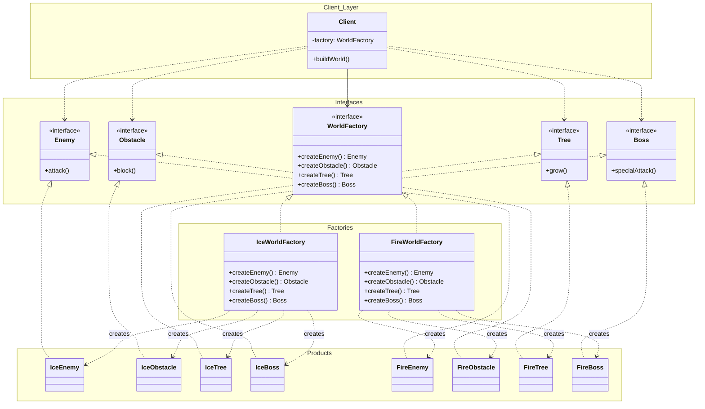

# 설계 패턴 개요
# 생성 패턴
## Abstract Factory
- 구체 클래스를 정의하지 않아도 상호 관련성이 있는 여러 객체군을 생성하기 위한 인터페이스를 제공하는 패턴
- 문제 및 동기
	- 

- 적용 대상
	- 생성, 조합, 표현 방식과 무관하게 시스템을 독립적으로 만들고자 하는 경우
		- 시스템이 "어떻게"만드는 지를 모르게 함
	- 다수의 제품군 중 하나를 선택하여 시스템을 설정하고, 한 번 구성한 제품을 다른 것으로 대체하고자 하는 경우
		- 제품군 간 제품이 섞이지 않도록 한다.
	- 제품에 대한 클래스 라이브러리를 제공하고, 그것들의 구현이 아닌 인터페이스를 표현하고자 하는 경우
		- 구현체는 감추고 인터페이스만 제공

- 패턴 구조
	- 객체를 생성하는 인터페이스: 인스턴스를 만드는 계약
		- 객체를 생성하는 구체 클래스: 인스턴스를 만드는 방법과 실제 인스턴스 생성 - "어떻게"
	- 제품 인터페이스: 제품군에 대한 계약 
		- 제품 구체 클래스: 실제 제품군 - "결과"



## Builder
- 복합 객체의 생성 과정과 표현 방법을 분리
	- 조립 순서는 Director가 고정
	- 각 단계에서 무엇을 만들어 쌓을지는 Builder가 결정
	- Builder를 갈아끼우면 같은 순서로 다른 결과물이 나온다.

- 문제 및 동기

- 적용 대상
	- 합성할 객체들의 표현이 서로 다르더라도, 생성과정이 동일한 경우

- 템플릿 메소드와 차이점
	- 템플릿 메소드: 절차의 골격을 상위 클래스에 고정하고, 가변 지점만 하위 클래스에 열어둔다
	- 빌더: 절차와 표현을 별개 객체로 분리해, 같은 절차로 다른 산출물을 만든다

- 예시
- Collector
```java
stream.collect(Collectors.toList());          // List
stream.collect(Collectors.joining(", "));     // String
stream.collect(Collectors.groupingBy(...));   // Map
```
- `supplier` → `accumulator` 반복 → `finisher` 순서는 동일하고 산출물이 다름

## Factory Method
- 객체를 만들기 위한 인터페이스를 정의
	- Product에 대한 의존성과 생성 책임을 옮김

![[Pasted image 20260807151017.png]]

## Porotoype
- 복사 책임을 객체 자신에게 위임함
- 클라이언트가 구체 클래스를 몰라도 이미 조립이 끝난 상태에서 새 인스턴스를 얻게 하는 생성 패턴이다
## Singleton
- 한 클래스의 인스턴스가 단지 하나만 생성될 수 있도록 보장한다
# 구조 패턴
## Adapter
- 호출자가 기대하는 인터페이스와 이미 존재하는 구현체의 인터페이스가 맞지 않을 때, 
	-  양쪽 코드를 수정하지 않고 그 사이에서 인터페이스를 변환해 주는 패턴.
## Bridge
- 기능과 구현의 개념을 분리하여 둘 다 독립적인 변경과 확장이 가능하도록 하는 패턴
	- N x M의 확장 경의 수를 N + M으로 축소 시킨다

|           | Abstraction     | Implementor    |
| --------- | --------------- | -------------- |
| 무엇의 추상화인가 | **문제 영역**의 추상화  | **해결 수단**의 추상화 |
| 다른 말로     | 요구사항의 추상화       | 플랫폼 능력의 추상화    |
| 종속성       | Implementor에 의존 | **아무것도 모름**    |

```Java
// Implementor: 원시 연산만
interface DrawingAPI {
    void drawLine(double x1, double y1, double x2, double y2);
    void drawArc(double x, double y, double r, double s, double e);
}

// Abstraction: primitive를 조합해 의미 있는 연산을 만든다
abstract class Shape {
    protected final DrawingAPI api;   // ← 이 참조가 "다리(bridge)"
    abstract void draw();
}

class RoundedRectangle extends Shape {   // RefinedAbstraction
    void draw() {
        api.drawLine(...); api.drawArc(...);   // 조합
        api.drawLine(...); api.drawArc(...);
    }
}
```
## Composite
- 계층 구조로 표현
- 개별 객체와 합성 객체를 동일하게 처리할 수 있다.
## Decorator
한 개개체의 구성 요소를 동적으로 추가하는 방법 제공

``` java
public interface OrderPrice {
    int calculate();
}

public class BaseOrderPrice implements OrderPrice {
    private final int amount;
    public BaseOrderPrice(int amount) { this.amount = amount; }
    public int calculate() { return amount; }
}

public abstract class Discount implements OrderPrice {
    protected final OrderPrice delegate;
    protected Discount(OrderPrice delegate) { this.delegate = delegate; }
}

public class CouponDiscount extends Discount {
    private final int rate;
    public CouponDiscount(OrderPrice delegate, int rate) { super(delegate); this.rate = rate; }
    public int calculate() {
        int prev = delegate.calculate();
        return prev - prev * rate / 100;
    }
}

public class MembershipDiscount extends Discount {
    public MembershipDiscount(OrderPrice delegate) { super(delegate); }
    public int calculate() {
        int prev = delegate.calculate();
        return prev - prev * 5 / 100;
    }
}

public class EventPromotionDiscount extends Discount {
    public EventPromotionDiscount(OrderPrice delegate) { super(delegate); }
    public int calculate() { return Math.max(0, delegate.calculate() - 3000); }
}

@Service
public class CheckoutFacade {

    OrderPrice buildOrder(int baseAmount, User user) {
        OrderPrice order = new BaseOrderPrice(baseAmount);

        if (user.couponRate > 0)
            order = new CouponDiscount(order, user.couponRate);

        if (user.isMember)
            order = new MembershipDiscount(order);
        else if (user.activeEventPromotion)   // 중복 규칙은 여기서
            order = new EventPromotionDiscount(order);

        return order;
    }

    public int checkout(int baseAmount, User user) {
        return buildOrder(baseAmount, user).calculate();
    }
}


```
## Facade
- 
## Flyweight
## Proxy
# 행위 패턴
## Chain of Responsibility
## Command
## Interprerter
## Iterator
## Mediator
## Memento
## Observer
## State
## Strategy
## Tempate Method
## Visitor