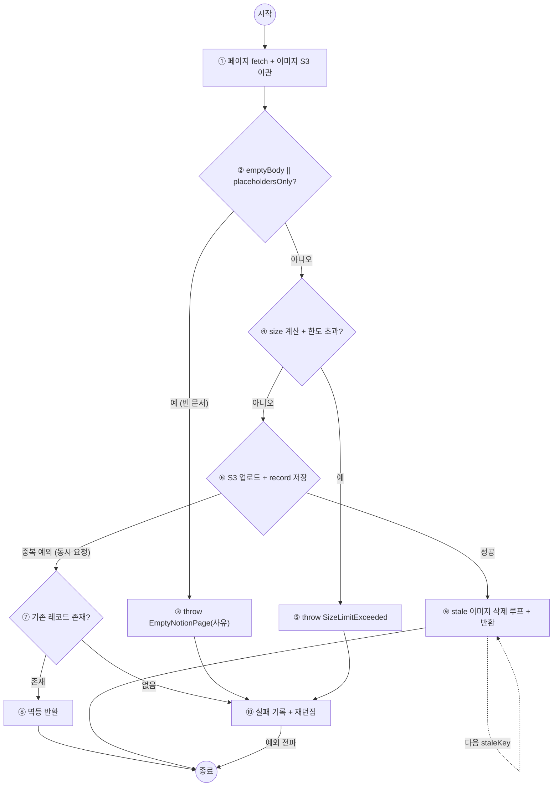

# 테스트 개요
- 검증(Verification): 이전 단계의 결과물과 현재 단계의 결과물이 일치하는지 확인하는 활동
	- 제품을 올바르게 만들고 있는가?
		- 예) 설계서에 정의된 API 응답 형식(JSON 필드명·타입)대로 구현됐는지 확인
- 확인(Validation): 산출물이 사용자의 요구사항을 만족하는지 확인하는 활동
	- 올바른 제품을 만들고 있는가?
		- 예) 베타 버전을 실제 사용자에게 배포해 사용성 문제를 수집

- 소프트웨어 V&V
	- 소프트웨어가 명세대로 만들어졌는지, 그리고 사용자의 실제 요구를 충족하는지를 개발 전 생애주기에 걸쳐 평가하는 활동

| 구분       | 정적 활동 (Static)                              | 동적 활동 (Dynamic)               |
| -------- | ------------------------------------------- | ----------------------------- |
| 실행 여부    | 실행하지 않음                                     | 실제로 실행함                       |
| 분석 대상    | - 요구사항 명세서<br>- 설계서<br>- 소스코드 <br>- 산출물 자체  | - 실행 중인 프로그램의 **동작과 출력**      |
| 발견하는 결함  | 결함의 원인 <br>(누락된 요구사항, 논리 오류, 표준 위반, 모호한 명세) | 결함의 증상<br>(오동작, 오류 발생, 성능 저하) |
| 발견 가능 범위 | 실행되지 않는 코드 경로까지 전수 점검 가능                    | 실행된 경로만 확인 가능 (테스트 케이스에 의존)   |
| 비용       | 상대적으로 저렴, 조기 발견으로 수정 비용 절감                  | 환경 구축·케이스 설계 비용 높음            |


## 소프트웨어 테스트
- 소프트웨어 테스트란
	- 명세된 요구사항과 실제 결과의 차이를 찾기 위해 실행하고 평가하는 과정

- 소프트웨어 테스트의 기본적인 활동
	1. 테스트를 위한 입력 데이터 준비
	2. 입력 데이터에 대한 실행 결과 모니터링
	3. 의도된 결과와 실제 실행 결과를 비교

- 전수 테스트가 불가능한 이유
	- 입력이 너무 많아서 물리적으로 많은 시간이 소요됨
### 예시 
```java
public class MarkdownHeaderHierarchyMergeStrategy implements SplitStrategy {

    public List<Piece> split(String text) { ... }

    // 둘 중 하나라도 min 미만이고, 합쳐도 max 이하일 때만 병합
    private boolean canMerge(Piece left, Piece right, int minChars, int maxChar, int forceMergeChars) {
        return left.mergeable() && right.mergeable()
                && (left.length() < minChars || right.length() < minChars)
                && left.length() + JOIN.length() + right.length() <= maxChars;
    }
}
```

#### 입력 공간(경우의 수)

| 입력                | 도메인               | 경우의 수             |
| ----------------- | ----------------- | ----------------- |
| `minChars`        | int, 1 이상         | 약 2.1 × 10⁹ (2³¹) |
| `maxChars`        | int, minChars 이상  | 약 2.1 × 10⁹       |
| `forceMergeChars` | int, 0 ~ minChars | 최대 약 2.1 × 10⁹    |
| `text`            | 길이 제한 없는 마크다운 문자열 | 무한                

#### 걸리는 시간
- 테스트 1건당 1μs라고 가정

| 범위                           | 경우의 수      | 소요 시간                                      |
| ---------------------------- | ---------- | ------------------------------------------ |
| 파라미터 튜플(min, max, force)만 전수 | 약 10²⁷     | 약 3.2 × 10¹³년 <br>(우주 나이 138억 년의 약 2,300배) |
| 100자짜리 텍스트까지 포함              | 약 10²⁰⁰ 이상 | ??                                         |

## 테스트 케이스와 테스트 오라클
- 테스트 케이스: 테스트를 수행하기 위한 샘플링된 입력 테이터
	- 주로 경계값 분석이 대표적인 케이스

- 테스트 오라클: 테스트 실행 결과를 검증하기 위한 메커니즘
	- 요구사항 명세로부터 명확한 예상 결과를 계산하기 어려운 경우가 많음
		- 사용자의 표현 != 코드
	- 오라클 생성을 위한 소스
		- 테스터의 주관적인 판단
		- 기존 유사 프로그램의 실행 결과 응용
		- 회귀 테스트에서 사용된 테스트 결과 활용
		- 정형 명세

#### 예시 - 마크다운 헤더 청킹 로직
##### 테스트 케이스

| ID   | 입력 (min=20, max=60) | 기대 결과   |
| ---- | ------------------- | ------- |
| TC-1 | 병합 결과가 정확히 max(60자) | 병합함     |
| TC-2 | 병합 결과가 max + 1(61자) | 병합하지 않음 |

```java
@Test
void 합계가_정확히_max면_병합한다() {
    // given — 10자 + 구분자 2자 + 48자 = 정확히 max(60자)
    String markdown = "# A\n가나다라마바\n# B\n" + "나".repeat(44);

    List<Chunk> chunks = strategy(20, 60).split(markdown);
}

@Test
void 합계가_max를_1자_넘으면_병합하지_않는다() {
    // given — 10자 + 구분자 2자 + 49자 = max + 1(61자)
    String markdown = "# A\n가나다라마바\n# B\n" + "나".repeat(45);

    List<Chunk> chunks = strategy(20, 60).split(markdown);
}
```

##### 테스트 오라클 적용 — 위 케이스들은 세 종류의 오라클로 정답을 판정한다.

###### 참 오라클 (True Oracle)
- 모든 입력의 정확한 기대 결과를 생성하고, 실제 결과와 완전 일치하는지 비교한다. 

```java
// 기준 구현이 두 입력의 "정확한 기대 결과"를 스스로 계산
assertThat(textsOf(strategy(20, 60).split(input60)))
		.isEqualTo(referenceChunker.chunk(input60, 20, 60)); // → 병합된 1개 청크
assertThat(textsOf(strategy(20, 60).split(input61)))
		.isEqualTo(referenceChunker.chunk(input61, 20, 60)); // → 분리된 2개 청크
```

###### 샘플링 오라클 (Sampling Oracle)
- 두 입력에 대해서만 기대 결과를 사람이 직접 계산해 하드코딩한다. 

```java
// 선정된 입력에 대한 기대 출력을 손으로 계산해 하드코딩
assertThat(textsOf(strategy(20, 60).split(input60)))
		.containsExactly("# A\n가나다라마바\n\n# B\n" + "나".repeat(44)); // 병합된 1개

assertThat(textsOf(strategy(20, 60).split(input61)))
		.containsExactly("# A\n가나다라마바", "# B\n" + "나".repeat(45)); // 분리된 2개
```

###### 추정 오라클 (Heuristic Oracle)
- 정확한 기대 출력 문자열 대신, 결과가 만족해야 할 추정치(개수·길이 범위·성질)로 판정한다.

```java
// 정확한 문자열 비교 대신 개수·길이·성질의 추정치로 판정
assertThat(merged).hasSize(1);                                  // 60자면 병합됐을 것
assertThat(merged.get(0).getText().length()).isLessThanOrEqualTo(60); // max 이하일 것

assertThat(split).hasSize(2);                                   // 61자면 분리됐을 것
assertThat(split).allSatisfy(c ->
		assertThat(c.getText().length()).isLessThanOrEqualTo(60));    // 각각 max 이하일 것

// 어느 쪽이든 내용 총량은 원문과 거의 같을 것 (구분자 오차 허용)
int total = merged.get(0).getText().length();
assertThat(total).isCloseTo(input60.length(), within(2));
```

###### 일관성 검사 오라클 (Consistency Check Oracle)
- 변경 전 버전이 같은 입력으로 만들어 둔 결과 스냅샷과 변경 후 결과가 동일한지 비교한다. 
- 리팩터링 전후의 회귀 검증에 쓴다.

```java
List<String> previous60 = loadSnapshot("input60.chunks.json"); // [병합된 1개]
List<String> previous61 = loadSnapshot("input61.chunks.json"); // [분리된 2개]

assertThat(textsOf(strategy(20, 60).split(input60))).isEqualTo(previous60);
assertThat(textsOf(strategy(20, 60).split(input61))).isEqualTo(previous61);
```

## 테스트의 단계

![[Pasted image 20260817162247.png]]

- 단위 테스트
	- 모듈/함수 중심 테스트
- 통합 테스트
	- 모듈간의 인터페이스 정확성을 테스트
- 시스템 테스트
	- 소프트웨어가 운영된 하드웨어 환경에서 소프트웨어를 테스트
- 인수 테스트
	- 사용자 환경에서 소프트웨어를 테스트
- 회귀 테스트
	- 테스트 과정에서 발견된 결함을 수정한 후 진행되는 테스트
### 테스트 드라이버와 테스트 스텁
- 테스트 드라이버
	- 완성된 모듈을 호출하는 상위 모듈이 없는 경우 임시로 만드는 상위 모듈
		- 예) JUnit
- 테스트 스텁
	- 상위 모듈에서 호출하는 하위 모듈이 없는 경우 임시로 대체하는 하위 모듈
		- 예) Mockito

# 코드 기반 테스트 케이스 생성 기법
- 화이트 박스 테스트는 코드를 실제로 실행하지 않고 코드의 구조만을 보고 테스트 케이스를 생성하는 방법이다
    - 구조적 테스트라고도 함

## 제어 흐름 그래프
- 코드의 구조를 수학적 모델로 바꾸는 방법

```java
// 예시에 직접 쓰이지 않는 세부는 이름에서 행동이 드러나는 함수로 추출해 압축했다.
// ②는 실제 구현의 hasNoContent()를 두 원자 조건으로 인라인한 것 —
// 거절 사유를 정확히 남기기 위해 두 판정을 모두 평가해 둔다(단락 평가에 의존하지 않는 형태)
public Content uploadNotionPage(String memberId, String connectionId, String notionPageId) {
    try {
/* ① */ var relocated = fetchPageAndRelocateImages(...);        // 페이지 fetch + 이미지 S3 이관
/* ② */ boolean emptyBody = relocated.isBlank(),                // 조건 A: 본문이 빈 문자열인가?
                placeholdersOnly = relocated.hasOnlyPlaceholders(); // 조건 B: placeholder만 남았는가?
        if (emptyBody || placeholdersOnly)                      // 빈 문서 판정 (A || B)
/* ③ */     throw new EmptyNotionPageException(notionPageId,
                    emptyBody ? EMPTY_BODY : PLACEHOLDER_ONLY); // 거절 사유 구분

/* ④ */ long size = relocated.utf8ByteSize();
        if (exceedsSizeLimit(size))
/* ⑤ */     throw new NotionPageSizeLimitExceededException(size, ...);

        NotionUploadRecord recorded;
        String url = uploadMarkdownToS3(relocated);
        try {
/* ⑥ */     recorded = recordUpload(size, url, relocated.images());   // 저장 성공 / 중복 예외(동시 요청)
        } catch (DataIntegrityViolationException e) {
/* ⑦ */     Content existing = findExistingUpload().orElseThrow(() -> e); // 존재 / 없음
/* ⑧ */     return importCompleted(existing);                    // 멱등 응답 (성공 분석 기록 포함)
        }

/* ⑨ */ for (String staleKey : recorded.staleKeys())             // 낡은 이미지 정리 루프
            s3.delete(staleKey);
        return importCompleted(recorded.content());

    } catch (RuntimeException e) {
/* ⑩ */ recordImportFailure(e); throw e;
    }
}
```

### 제어 흐름 그래프 (Mermaid)



## 경로 기반 테스트 케이스 생성
- 제어 흐름 그래프를 바탕으로 테스트 케이스를 도출하는 방법들
- 테스트 케이스 생성시 고려할 사항 => 테스트 커버리지
- 테스트 커버리지란
    - 테스트 케이스가 전체 코드를 얼마나 검증했는지 정도
    - 전체 코드 => 커버리지마다 달라짐

### 구문 커버리지 (Statement Coverage)
- 테스트가 지나는 구문을 기준으로 측정하는 방법
    - 모든 구문을 적어도 한번 지나는 경우 100%

> [!note]+ 구문(Statement)란
> - 컴퓨터가 특정 동작을 수행하도록 지시하는 독립적인 코드의 최소 실행 단위
> - 예시
>     - 조건문
>     - 할당문
>     - 반복문
>     - 점프문

#### 예시

```java
// S1~S15: 구문 번호 — 앞의 CFG(①~⑩) 전체를 포함한다
public Content uploadNotionPage(String memberId, String connectionId, String notionPageId) {
    try {
S1:     var relocated = fetchPageAndRelocateImages(...);            // ① def(relocated)
S2:     boolean emptyBody = relocated.isBlank(),                    // ② def(A·B) — 둘 다 평가된다
                placeholdersOnly = relocated.hasOnlyPlaceholders();
S3:     if (emptyBody || placeholdersOnly)                          //   D1 = A || B: p-use(A·B) ← 조건 커버리지 예시
S4:         throw new EmptyNotionPageException(notionPageId,        // ③ 예외① — c-use(emptyBody, 사유 선택)
                    emptyBody ? EMPTY_BODY : PLACEHOLDER_ONLY);

S5:     long size = relocated.utf8ByteSize();                       // ④ def(size)
S6:     if (exceedsSizeLimit(size))                                 //   D2: p-use(size) — 한도 4,718,592B
S7:         throw new NotionPageSizeLimitExceededException(size, ...); // ⑤ 예외②

        NotionUploadRecord recorded;
S8:     String url = uploadMarkdownToS3(relocated);                 // ⑥ def(url) — 같은 키 → 재업로드 시 덮어쓰기
        try {
S9:         recorded = recordUpload(size, url, relocated.images()); //   D3: 성공/중복 예외, def(recorded)
        } catch (DataIntegrityViolationException e) {
S10:        Content existing = findExistingUpload().orElseThrow(() -> e); // ⑦ D4: 존재/없음, def(existing)
S11:        return importCompleted(existing);                       // ⑧ 멱등 응답
        }

S12:    for (String staleKey : recorded.staleKeys())                // ⑨ D5: 루프, def(staleKey)
S13:        s3.delete(staleKey);
S14:    return importCompleted(recorded.content());

    } catch (RuntimeException e) {
S15:    recordImportFailure(e); throw e;                            // ⑩
    }
}
```

| TC  | 입력 (페이지 내용 · 사전 상태)                              | 과정 (실행 경로)                                                           | 예상 출력                                |
| --- | ------------------------------------------------ | -------------------------------------------------------------------- | ------------------------------------ |
| TC1 | 이관 후 placeholder만 남는 빈 문서                        | S1 → S2 → S3 → S4 → S15                                              | EmptyNotionPageException             |
| TC2 | 1KB 본문 · staleKeys 0개                            | S1 → S2 → S3 → S5 → S6 → S8 → S9 → S12 → S14                         | 새로 저장된 Content 반환                    |
| TC3 | 20MB 본문 (한도 4,718,592B 초과)                       | S1 → S2 → S3 → S5 → S6 → S7 → S15                                    | NotionPageSizeLimitExceededException |
| TC4 | 1KB 본문 · 동시 중복 요청으로 record 중복 예외 · DB에 기존 레코드 존재 | S1 → S2 → S3 → S5 → S6 → S8 → S9 → S10 → S11                         | 기존 Content 반환 (멱등)                   |
| TC5 | 1KB 본문 · 동시 중복 요청으로 record 중복 예외 · 기존 레코드 없음     | S1 → S2 → S3 → S5 → S6 → S8 → S9 → S10 → S15                         | DataIntegrityViolationException 전파   |
| TC6 | 1KB 본문 · staleKeys 2개                            | S1 → S2 → S3 → S5 → S6 → S8 → S9 → S12 → S13 → S12 → S13 → S12 → S14 | 새로 저장된 Content 반환                    |
##### 100% 달성 조합 찾기 (greedy)

| 단계  | 선택          | 새로 커버되는 구문                     | 누적               |
| --- | ----------- | ------------------------------ | ---------------- |
| 1   | TC6 (단독 최다) | S1~S3, S5, S6, S8, S9, S12~S14 | 10/15 = 67%      |
| 2   | + TC4       | S10, S11 (중복 예외 경로)            | 12/15 = 80%      |
| 3   | + TC1       | S4 (예외①), S15                  | 14/15 = 93%      |
| 4   | + TC3       | S7 (예외②)                       | **15/15 = 100%** |

- 구문 커버리지문제
	- 본문이 완전히 빈 문서(A=T, B=F)와 placeholder만 남은 문서(TC1: A=F, B=T)는 입력이 다르지만 구분하지 않음

---
### 분기 커버리지
- 테스트가 지나는 분기를 기준으로 측정하는 방법
    - 모든 분기를 적어도 한번 지나는 경우 100%
    - 분기
        - if
        - switch
        - for
        - while
        - 등
#### 예시
- 분기 결정 5개
    - D1(② 빈 문서 판정, T/F)
    - D2(④ 한도 초과, T/F)
    - D3(⑥ 저장 성공/중복 예외)
    - D4(⑦ 존재/없음)
    - D5(⑨ 루프 진입 T / 탈출 F)

| TC  | D1  | D2  | D3    | D4     | D5     | 비고          |
| --- | --- | --- | ----- | ------ | ------ | ----------- |
| TC1 | T   | –   | –     | –      | –      |             |
| TC2 | F   | F   | 성공    | –      | F (0회) | TC3와 동일한 경로 |
| TC3 | F   | T   | –     | –      | –      |             |
| TC4 | F   | F   | 중복 예외 | T (존재) | –      |             |
| TC5 | F   | F   | 중복 예외 | F (없음) | –      |             |
| TC6 | F   | F   | 성공    | –      | T→T→F  |             |

- {TC1, TC3, TC4, TC5, TC6} 으로 100%

---
### 데이터 흐름 커버리지
- 테스트에서 사용하는 변수의 선언과 사용을 기준으로 측정하는 방법
    - 모든 변수에 대하여 선언과 사용를 적어도 한번씩 사용하는 경우

- All-Def: 선언된 모든 변수를 적어도 한 번 사용하는 경로까지 테스트
- All-Uses: 선언된 하나의 변수를 사용하는 모든 지점까지 테스트
- All-DU: 선언된 모든 변수를 사용하는 모든 지점을 테스트

#### 예시
- 변수별 def-use
    - `relocated`: def(S1) 
		- → c-use(S2), c-use(S5), c-use(S8), c-use(S9)
    - `emptyBody`·`placeholdersOnly`: def(S2) 
		- → p-use(S3), c-use(S4 — 거절 사유 선택)
    - `size`: def(S5) 
	    - → p-use(S6), c-use(S7), c-use(S9)
    - `url`: def(S8) 
	    - → c-use(S9)
    - `recorded`: def(S9) 
	    - → c-use(S12), c-use(S14)
    - `existing`: def(S10, 없으면 예외) 
	    - → c-use(S11)
    - `staleKey`: def(S12, 반복마다 재정의)
	    - → c-use(S13)

- **All-Defs**: 각 def에서 use 하나씩 → {TC6, TC4}
	- TC6: `relocated`, `emptyBody`·`placeholdersOnly`, `size`, `url`, `recorded`, `staleKey`
	- TC4: `relocated`, `emptyBody`·`placeholdersOnly`, `size`, `url`, `existing`

- **All-Uses**: 모든 du-쌍 → {TC1, TC3, TC4, TC6}
	- TC1: `relocated`, `emptyBody`·`placeholdersOnly` 
	- TC3: `relocated`, `emptyBody`·`placeholdersOnly`, `size`, (c-use S7 포함)
	- TC4: `relocated`, `emptyBody`·`placeholdersOnly`, `size`, `url`, `existing` (c-use S7 없음)
	- TC6: `relocated`, `emptyBody`·`placeholdersOnly`, `size`, `url`, `recorded`, `staleKey`

- **All-DU**: 이 그래프에서 각 du-쌍의 def-clear 경로는 1개뿐이라 All-Uses와 동일. 
---
### 조건 커버리지
- 테스트에서 지나는 조건문의 결과를 기준으로 측정하는 방법
    - 조건문 모든 가능한 결과를 적어도 한번씩 지나는 경우 100%
- 진리표를 기준으로 모든 경우의 수를 테스트 해야 한다.

A or B 인 경우

| 케이스 | A   | B   | D   |
| --- | --- | --- | --- |
| C1  | T   | T   | T   |
| C2  | T   | F   | T   |
| C3  | F   | T   | T   |
| C4  | F   | F   | F   |

---

### 다수 조건 분기 커버리지
- 조건 커버리지와 분기 커버리지를 함께 고려하여 측정하는 방법

| 케이스 | A   | B   | D   |
| --- | --- | --- | --- |
| C1  | T   | T   | T   |
| C2  | T   | F   | T   |
| C3  | F   | T   | T   |
| C4  | F   | F   | F   |
A or B + C(A && B)

| 케이스 | A   | B   | C   |
| --- | --- | --- | --- |
| C1  | T   | T   | T   |
| C2  | T   | F   | F   |
| C3  | F   | T   | F   |
| C4  | F   | F   | F   |

- C4는 C3는 동일한 결과이기 때문에 C4는 없어도 됨

---
# 오류 기반 테스트
- 프로그래밍 과정에서 개발자의 실수가 잠재적으로 내재되었는지를 평가하기 위한 목적으로 수행하는 테스트 기법
	- 프로그래머가 만들어내기 위운 결함을 찾기한 목적 => 결함이 자주 발생하는 곳에세 예측 가능하다.
		- 실수에 대한 히스토리
		- 오류 발생이 쉬운 문법적 요소
		- 응용 영역의 특성

- 테스트 케이스 생성 방법: 뮤턴트 커버리지
- 뮤턴트 커버리지
	- 결함 주입
		- 원본 코드에서 나타나는 요소(변수, 연산자등)들을 다른 것으로 대체하여 뮤턴트 생성
	- 뮤턴트 요소
		- 논리연산자
		- 관계연산자
		- 문장 삭제
		- 단항연산자 삽입
		- 배열 참조에 대한 대체
		- 산술 연산자의 대체
# 동적 심볼릭 테스트
- 실행 기반 테스트 + 기호 실행 기반 테스트를 혼합한 기법

## 기호 실행
- 입력에 대한 기호 값을 기반으로 프로그램 실행을 진행하는 방법

## 콘콜릭 실행
- 콘콜릭을 수행하려면 SMT가 필요함
	- SMT란?
		- 어떤 제약 사항이 주어졌을 때, 모든 가능한 조합을 고려하여 만족할 많한 해를 결정해주는 기능
		- 콘콜릭테스트에서 실제 사용할 입력 값을 계산하는 기능을 수행한다.
- CS
	- 코드의 특정 지점에 있는 실제 값을 저장하는 변수
- SS
	- 코드의 특정 지점에 있는 심볼 값을 저장하는 변수
- PC
	- 특정 지점에서 만족되어야 하는 분기 조건을 저장하는 변수

![[Pasted image 20260817200807.png]]

- main()에서 x, y를 읽음. 임의의 값 2, 1로 지정한다.  
    PC는 초기값이 참이다.  
    아래는 15 행 실행 이후 변수 값이다.
    
    - CS : x=2, y=1
    - SS : x=x0, y=y0
    - PC : true

- 16행 test() 를 실행. 6행에서 z=twice(y) 실행 후 값이다.
    
    - CS : x=2, y=1, z=2
    - SS : x=x0, y=y0, **z=2*y0**
    - PC : true

- 7행 if(x=\=z) 실행 후 값.
    
    - CS : x=2, y=1, z=2
    - SS : x=x0, y=y0, z=2*y0
    - PC : x0=\=2*y0

- 8행 if(x>y+10) 실행 후 값.  
    이 **조건을 만족**하면 **Error가 실행**된다.
    
    - CS : x=2, y=1, z=2
    - SS : x=x0, y=y0, z=2*y0
    - PC : **x0\==2*y0** and **x0>y0+10**
- PC (**x0=\=2*y0** and **x0>y0+10**) 조건에 만족하는 값은 다음과 같다.
    
    - **x = 30, y = 15**  
        30=\=2_15 and 30>25 -> 만족.  
        20=2_10 and 20>10+10 -> 불만족.

---
