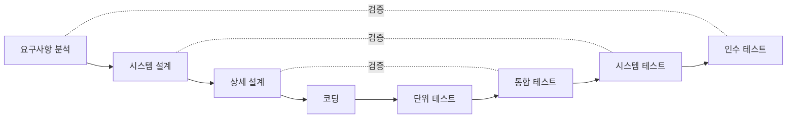

# 블랙박스 테스트 개요
- 블랙박스 테스트란
	- 코드 없이 요구사항 명세만을 이용하여 테스트 케이스를 생성하는 테스트 기법
	- 기능적 테스트(Functional Test)라고도 함
- 특징
	- 내부 구조와 동작 원리를 고려하지 않음
	- 올바른 입력과 잘못된 입력을 사용하여 출력의 정확성을 검증
	- 모든 테스트 단계(단위, 통합, 시스템, 인수)에 적용 가능
- 필요한 산출물
	- 소프트웨어의 공개된 특징, 요구사항 명세서, 설계서 등

| 구분        | 화이트박스 테스트          | 블랙박스 테스트             |
| --------- | ------------------ | -------------------- |
| 기준 산출물    | 소스 코드              | 요구사항 명세              |
| 관점        | 코드의 구조 (경로, 분기, 조건) | 기능의 입력과 출력           |
| 커버리지      | 구문·분기·조건 등 코드 커버리지 | 동치 클래스·경계값 등 입력 도메인  |
| 주 적용 단계   | 단위 테스트             | 단위 ~ 인수 테스트 전 단계     |

## 휴리스틱
- 코드가 없어 경로 선택이 불가능하므로, 경험에 의한 지식(휴리스틱)을 활용하여 테스트 케이스를 생성한다
	1. 동치 분할
	2. 경계치 커버리지 분석
	3. 특수치 커버리지 분석
	4. 원인/효과 커버리지 분석

## 테스트 수행 절차
1. 테스트 계획 수립
2. 목적, 목표, 종료 조건 정의
	- 기간 중심
		- 예) 1주일 동안 테스트 수행
	- 결함 수 중심
		- 예) 모듈당 결함 0.01 이하
3. 테스트 케이스 설계
	1. 요구사항 이해
	2. 입력 변수 도출
	3. 동치 분할 수행
	4. 경곗값/특수치 분석
	5. 테스트 데이터 식별자 부여
	6. 예상 결과 생성
4. 테스트 준비
5. 테스트 케이스 기반 테스트 수행
6. 결과 평가
7. 결과 반영
8. 절차 개선

---
# 기능 기반 테스트 케이스 생성 기법

## 동치 분할 (Equivalence Partitioning)
- 동등한 처리를 수행하는 그룹으로 입력값을 동치 클래스(Equivalence Class)로 분할하는 기법
	- 같은 클래스에 속한 값들은 프로그램이 동일하게 처리한다고 가정 → 클래스당 대표값 하나만 테스트
- 테스트 데이터 생성
	- 입력 데이터와 기능의 관계를 고려
	- 입력 도메인이 유효(Valid) / 무효(Invalid) 동치 클래스로 분할됨

- 동치 클래스 분할 시 고려할 상황

| 상황            | 분할 방식             | 예시                            |
| ------------- | ----------------- | ----------------------------- |
| 일정 값의 영역      | 범위 내 값 / 범위 밖 값   | 1~99 범위 → {50, 100}           |
| 데이터 타입        | 정해진 타입 / 다른 타입    | 정수형 → {10, 0.5}               |
| 제약 조건         | 유효값 포함 여부         | 인덱스 변수 → {4, -6}              |
| 동치 클래스 내 제약   | 하위 동치 클래스로 재분할    | 100 이하 / 100~200 / 200 이상     |
| 부정확한 데이터      | 다른 타입의 값 선정       | 정수형 변수 → 문자열, 실수              |

## 경계치 커버리지 분석 (Boundary Value Analysis)
- 동치 클래스의 경계 값을 테스트 데이터로 선정하는 기법
	- 결함은 동치 클래스의 중앙보다 경계에서 훨씬 자주 발생한다

- 적용 예시
	- \[-1.0, +1.0\] 범위 → {-1.1, -1.0, +1.0, +1.1}
	- 1~100 범위 → {0, 1, 100, 101}
	- 순서 집합 {A, B, C, D, F} → 처음과 끝 원소 {A, F}

#### 예시 - 노션 페이지 업로드 크기 제한
- Chapter 14의 `uploadNotionPage()`는 본문 크기가 4,718,592B를 초과하면 `NotionPageSizeLimitExceededException`을 던진다
- 명세만 보고(코드 없이) 경계치를 선정하면

| TC   | 본문 크기(B)      | 동치 클래스  | 기대 결과                 |
| ---- | ------------- | ------- | --------------------- |
| TC-1 | 4,718,591     | 유효 (한도 내) | 업로드 성공                |
| TC-2 | 4,718,592     | 유효 (경계)   | 업로드 성공                |
| TC-3 | 4,718,593     | 무효 (경계+1) | 예외 SizeLimitExceeded  |

## 특수치 커버리지 분석 (Special Value Analysis)
- 기능(도메인 지식)을 중심으로 특수한 의미를 갖는 값을 테스트 케이스로 선정하는 기법
- 사용 시기
	- 알고리즘의 특징을 반영해야 하는 경우
	- 특수 함수를 사용하는 경우
	- 오류 발생이 빈번한 변수가 있는 경우
- 예시
	- 사인 함수 → {0, π/2, π, 3π/2, 2π}

## 원인 결과 커버리지 분석 (Cause-Effect Analysis)
- 입력 조건(원인)의 조합과 그에 따른 동작(결과)의 논리적 관계를 기준으로 테스트 케이스를 생성하는 기법
	- 동치 분할·경계치 분석은 입력 변수를 하나씩만 보므로, **입력 조합**에 의한 결함을 놓칠 수 있다

- 의사결정 테이블 (Decision Table)
	- 동치 클래스를 테이블 형태로 표현
	- 상단: 입력 변수(원인)의 조합, 하단: 조건에 따른 동작(결과)
	- 각 컬럼이 하나의 테스트 데이터가 됨
- 원인-결과 그래프 (Cause-Effect Graph)
	- 원인 노드, 결과 노드, 에지(처리 관계)로 구성
	- 입력 조건 간의 논리적 관계(AND, OR, NOT)를 표현

## 테스트 케이스 생성 예제 - 주급 산정 시스템
- 요구사항
	- 고유번호: 5자리 숫자
	- 근무시간: 0~40시간은 기본급, 40~56시간은 초과분에 1.5배 수당
	- 시급: $10

### 1. 동치 분할

| 분류      | 고유번호                                                       | 근무시간                          |
| ------- | ---------------------------------------------------------- | ----------------------------- |
| Valid   | V1: 5자리 숫자                                                 | V2: 0~40 / V3: 40~56          |
| Invalid | I1: 99999, 00000 / I2: 5자리 초과 / I3: 5자리 미만 / I4: 숫자가 아닌 값 | I5: 0 이하 / I6: 56 이상 / I7: 기타 |

### 2. 경계치 분석
- 고유번호: {00001, 99998, 99999}
- 근무시간: {0, 40, 41, 56, 57}

### 3. 테스트 케이스 도출
- 예) 근무시간 45시간 (40시간 초과분 5시간)
	- 주급 계산: 40 × $10 + 5 × $10 × 1.5 = $475
	- 예상 출력: 고유번호.475

---
# 시나리오 기반 테스트
- 개발 후, 사용 시나리오를 바탕으로 테스트 케이스를 생성하는 기법
- 생성 방법
	1. 아웃라인 방법
	2. 유스케이스 방법
- 방법 선정 기준
	- 테스터의 경험과 선호도
	- 요구사항의 형식
	- 개발 도구의 가용성

## 예제 - 쇼핑몰 안내 시스템
- 액터(Actor)
	- 상점을 찾는 고객
	- 상점을 관리하는 관리자

## 아웃라인 방법
- 입력부터 종료까지의 순차적 과정을 식별하여 테스트 케이스를 생성하는 방법
	- 메인 화면 흐름: 입력 → 서비스 전개의 순차 흐름
	- 매장 목록 흐름: 입력에 따른 순차적 동작

- 테스트 케이스 생성 방법
	1. 화면 단위로 사용자 입력에 따른 화면 전환을 식별
	2. 요구사항에 따라 예상 결과를 정의
	3. 각 화면의 모든 분기 입력에 대해 예상 결과를 정의
	4. 실제 결과에 Pass/Fail을 기록

## 유스케이스 방법
- 유스케이스 명세를 바탕으로 테스트 케이스를 생성하는 방법

- 유스케이스 명세 구성
	- **Goal (목적)**: 고객이 특정 상점을 찾기 원함
	- **Success Guarantees (성공 보장)**: 원하는 매장이 표시된 맵을 얻음
	- **Main Success Scenario (주 성공 시나리오)**: 매장 유형 선택 → 매장 이름 선택 → 인쇄
	- **Extensions (예외 처리)**: 도움말이 필요한 경우, 매장을 찾을 수 없는 경우 등

- 테스트 케이스 생성 방법
	1. 메인 시나리오의 단계별로 테스트 케이스를 생성
	2. 사용자 입력을 기준으로 생성
	3. 출력은 예상 결과로 정의
	4. Extensions(예외 처리)도 필수적으로 테스트 케이스화

---
# 테스트 단계 (V 모델 기반)

## 단위 테스트
- 모듈이 정확히 동작하는지 테스트하는 단계
- 특징
	- 코드 검토가 가능하므로 주로 화이트박스 테스트를 수행
	- 블랙박스 테스트도 가능
- 대상
	- 함수, 모듈, WBS의 태스크, 화면 단위
- 고려사항
	- 예상 결과 작성 방법 검토
	- 테스트 드라이버 개발
		- 예) JUnit
	- 테스트 스텁 개발
		- 예) Mockito

## 통합 테스트
- 단위 테스트를 거친 모듈들이 통합된 후 발생 가능한 문제를 검사하는 단계
	- 중점: 모듈 간 상호작용, 인터페이스의 일관성

- 단위 테스트를 통과했어도 통합 테스트가 필요한 이유
	1. 인터페이스가 잘못 사용되는 경우
	2. 모듈 기능 구현에 잘못된 가정이 있는 경우
	3. 테스트 드라이버·스텁에 오류가 있는 경우

### 비점증적 통합 (빅뱅 테스트)
- 모든 모듈을 한 번에 통합하여 테스트
	- 장점: 빠름
	- 단점: 결함 발생 시 원인 파악이 어려움

### 점증적 통합
- 모듈을 한 번에 하나씩 통합하며 테스트

| 방식       | 특징                     | 장점             | 단점                        |
| -------- | ---------------------- | -------------- | ------------------------- |
| 하향식      | main()에서 가까운 모듈부터 통합   | 서브시스템 단위 테스트 가능 | 스텁 개발 필요                  |
| 상향식      | 최하위 함수부터 통합            | 스텁 불필요         | 후반부 상위 모듈 수정 시 하위 모듈 재테스트 |
| 스레드 기반   | 제어 중심 스레드에서 가까운 모듈부터   | -              | -                         |
| 샌드위치     | 하향식 + 상향식 병행           | 대형 프로그램에 적합    | -                         |
| 핵심 모듈 기반 | 가장 중요한 모듈부터 통합         | 인터페이스 오류 검사 용이 | -                         |

## 시스템 테스트
- 개발된 시스템을 실제 동작할 환경과 동일한 하드웨어 플랫폼에 설치하여 수행하는 테스트
- 특징
	- 전체 시스템을 대상으로 테스트
	- 블랙박스 기반 기법 사용
	- 기능, 성능, 품질에 중점
	- 메모리, 하드웨어 인터페이스 등 실제 환경 필요

## 인수 테스트 (수락 테스트)
- 시스템을 사용자에게 전달하기 전에 수행하는 테스트
- 진행 형태: 시스템 테스트 → 알파 → 베타 (→ 감마)

- 알파 테스트
	- 전문가 및 전문 지식을 가진 사용자가 테스터
	- 개발 팀과 함께 개발 장소에서 수행
- 베타 테스트
	- 사용자 환경에 설치하여 일정 기간 시범 운영
	- 오류 검출이 목적
- 감마 테스트
	- 출시 후 실제 사용자가 사용하며 테스트
	- 성능, 편의성 평가

## 회귀 테스트
- 개발/운영 중인 소프트웨어에 기능 추가나 결함 제거 후, 변경이 기존 기능을 깨뜨리지 않았는지 확인하는 테스트

| 전략                   | 방식                                | 장점         | 단점                 |
| -------------------- | --------------------------------- | ---------- | ------------------ |
| Retest All (전수)      | 수정 전 테스트 케이스 + 추가 기능 테스트 케이스 전부 수행 | 높은 테스트 커버리지 | 비용 증가              |
| Selective (선택적)      | 변경된 부분 중심으로 테스트                   | 비용 효율적     | 완전한 테스트 불가능        |
| Priority (우선순위 기반)   | 중요도·결함 위험성 기반으로 핵심 기능에 우선순위 부여     | 비용 효과적     | 낮은 우선순위 변경의 영향 미감지 |

> [!note]+ Chapter 14의 일관성 검사 오라클과의 연결
> 회귀 테스트에서 "변경 전 결과 스냅샷과 변경 후 결과가 동일한가"를 판정하는 것이 바로 일관성 검사 오라클(Consistency Check Oracle)이다. 전수/선택적/우선순위는 **어떤 케이스를 다시 돌릴지**의 전략이고, 오라클은 **돌린 결과를 무엇과 비교할지**의 메커니즘이다.
