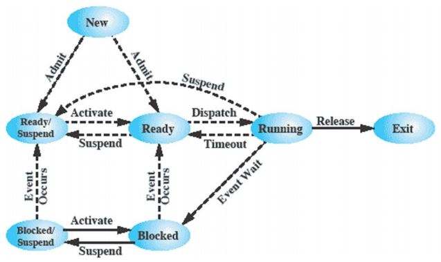
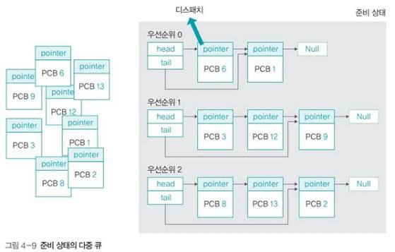
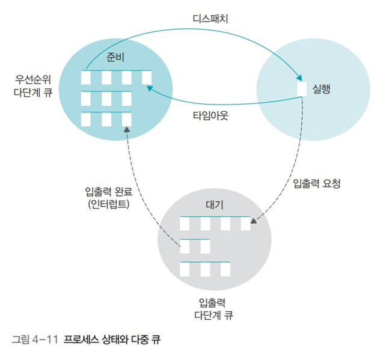

## 스케줄링 개요
### CPU 스케줄링
- 여러 프로세스가 있을 때 한정된 CPU 자원을 어떤 프로세스에 언제 할당할지 결정하는 작업이다.

- 필요한 이유
	- CPU는 한정된 자원임
		- 사용하고 싶은 프로세스는 여러 개임
		- CPU의 노는 시간을 줄여야 함
		- 프로세스마다 중요도가 다름
#### 고수준 스케줄링
- Long-term scheduling, job scheduling이라고도 함
- 시스템 내의 전체 작업수를 조절
	- 멀티 프로그래밍 정도(Degree of Multiprogramming)를 조절
	- 작업의 승인/거부를 결정하므로 Admission Scheduling이라고도 불림

```
메모리

┌──────────────────┐
│ OS               │
├──────────────────┤
│ Process A        │ ← Ready
├──────────────────┤
│ Process B        │ ← Running
├──────────────────┤
│ Process C        │ ← Waiting (I/O)
├──────────────────┤
│ Process D        │ ← Ready
└──────────────────┘

=> Degree of Multiprogramming: 4개
```


> [!note]+ 현대 컴퓨터에서 고수준 스케줄링을 사용하지 않는 이유
> - 현대 컴퓨터는 고수준 스케줄링을 사용하지 않음
> 	- 물리 메모리의 크기가 커지고 더 효과적으로 관리(가상 메모리)할 수 있어 필요성이 감소함
> 	- 요즘은 프로세스를 생성하고 프로세스의 자원을 관리하는 방식이 일반적임
> 	- 배치·클러스터 등의 시스템에서는 여전히 중요한 역할을 함
> 		- kubernetes, HCP batch scheduler
> 			- OS 계층이 아닌 소프트웨어 계층에서 사용


#### 저수준 스케줄링
- short-term scheduling이라고 부름
- 하는 일
	- 프로세스에게 CPU 할당
	- 프로세스의 상태 변경 (E.g 대기 -> 준비, 준비 -> 실행, ...)

#### 중간수준 스케줄링
- 메모리에 유지되는 프로세스의 수를 조절. suspend와 active를 통해 경쟁하는 프로세스의 수를 조절함
	- 스왑에 관여함



### 스케줄링의 목적
- 모든 프로세스가 공평하게 작업하도록 하는 것
	- 자원이 특정한 프로세스에 몰리지 않고 골고루 배분하기 위해서 
	- 하지만 시스템의 안정성과 효율성을 위해서 일부 공평성을 희생한다.
		- 안정성: 운영체제 프로세스가 일반 프로세스 보다 우선 CPU를 할당 받음
		- 효율성: 짧은 작업이나 I/O 위주 프로세스에 CPU를 먼저 할당함

| 목적           | 설명                                                                      |
| ------------ | ----------------------------------------------------------------------- |
| **공평성**      | 모든 프로세스가 자원을 공평하게 배정받아야 하며, 그 과정에서 특정 프로세스가 배제되어서는 안 됨                  |
| **효율성**      | 시스템 자원이 유휴 시간 없이 사용되도록 스케줄링하고, 유휴 자원을 사용하려는 프로세스에는 우선권 부여               |
| **안정성**      | 우선순위를 사용하여 중요 프로세스가 먼저 작동하도록 배정함으로써, 시스템 자원을 점유하거나 파괴하려는 프로세스로부터 자원을 보호 |
| **확장성**      | 프로세스가 증가해도 시스템이 안정적으로 작동하고, 시스템 자원이 늘어나는 경우 그 혜택이 시스템에 반영되어야 함          |
| **반응 시간 보장** | 응답이 없으면 사용자는 시스템이 멈춘 것으로 생각하므로, 적절한 시간 안에 프로세스의 요구에 반응해야 함              |
| **무한 연기 방지** | 특정 프로세스의 작업이 무한히 연기되어서는 안 됨                                             |

## 스케줄링 시 고려 사항
### 선점형 VS 비선점형

- 선점형: 다른 프로세스가 사용중인 CPU를 운영체제가 강제로 뺏을 수 있음
	- 장점:
		- 응답 시간 보장
	- 단점
		- 빈번한 문맥 교환
		- 스케줄러의 작업량이 많아짐
- 비선점형: 다른 프로세스가 사용중인 CPU를 운영체제가 강제로 뺏을 수 없음
	- 장점
		- 스케줄러의 작업량이 적다
		- 문맥 교환이 적게 발생한다.
	- 단점
		- 응답 시간 저하
		- CPU 독점

> [!note]+ 최신 OS가 사용하는 방식은?
> - Linux: 타이머 인터럽트(tick) 및 가상 실행 시간 기반으로 선점
> - Windows: 우선순위 기반 선점형 ( 우선순위 + 퀀텀(time slice))
> - macOS: 스케줄러 기반 우선순위 선점형, QoS 클래스별로 우선순위 조정
> 
> 이유
> - 대화형 시스템의 응답성 보장: 사용자와 인터랙션이 많아진 최신 컴퓨터에서 사용자에게 응답 시간을 보장해주기 위해서
> - 신뢰성: 비선점형의 경우 하나의 앱이 멈추면 OS가 멈추어 버리는 문제를 해결하기 위해서
> - 우선순위 보장: 우선순위가 높은 프로세스가 처리 성능을 보장하기 위해서
> - 멀티코어 활용: 실행 중인 프로세스를 다른 코어로 이동시켜 부하 분산을 위해서


### 프로세스 우선순위
- 우선 순위: CPU를 먼저 차지할 권리에 대한 중요도
	- 우선순위가 높으면 더 빨리 더 자주 실행된다.
- 예시
	- 커널 프로세스 Vs 일반 프로세스
		- 메모리가 부족해지면 페이지를 회수해야 하는데 회수가 늦으면 모든 프로세스가 할당 요청에서 멈추기 때문에, 회수 스레드 하나가 밀려서 시스템 전체가 멈추는 문제가 발생한다.
	- 일반 프로세스 Vs 일반 프로세스
		- 동영상 디코더와 메모장이 같은 우선순위로 CPU를 나눠 쓰면, 16.7ms 안에 프레임을 채우지 못한 동영상은 화면이 끊기지만 메모장은 수십 ms 늦어도 아무 손해가 없다.

### CPU 집중 프로세스와 입출력 집중 프로세스
- CPU Bound process: 총 실행 시간의 대부분을 CPU 점유가 차지하는 프로세스. 
	- e.g. 암복호화, 수식 연산
- I/O Bound Process: 총 실행 시간의 대부분을 I/O 완료 대기가 차지하는 프로세스. 
	- e.g. 파일 복사, 네트워크 다운로드

- CPU를 적게 사용하는 I/O Bound Process를 먼저 시작하고 IO 대기 시간에 CPU Bound 작업을 하는 것이 효과적이다.
### 전면 프로세스와 후면 프로세스
- 전면 프로세스: 사용자로부터 입력을 받아 처리하는 프로세스
- 후면 프로세스: 사용자와 상호작용이 없는 프로세스

- 전면 프로세스가 사용자와 실시간으로 상호작용하므로 후면 프로세스보다 더 높은 우선순위를 가져야 한다.

> 스케줄링의 목적은 `공평성`이지만 성능을 위해서 우선순위를 이용하여 차별한다.


## 다중 큐
### 준비 상태의 다중 큐
- 우선순위별 준비 큐
	- 우선 순위가 높은 프로세스를 먼저 실행해야함
		- 매번 프로세스 무더기에서 찾으면 시간이 많이 걸림 => 우선순위마다 큐를 두어 큐에서 프로세스를 하나씩 빼감
	- => 일일이 우선순위가 높은 프로세스를 찾지 않아도 됨



### 대기 상태의 다중 큐
- 장치별 대기큐(but 목록에 가까움)
	- 사용하는 이유
		- 입출력이 완료되면 대기상태에 있는 프로세스를 준비 상태로 변경해야함
			- 프로세스 무더기에서 어떤 입출력이 완료되었는지 확인하고 해당 입출력 때문에 대기 중인 프로세스를 찾기 어려움
		- => 각 입출력마다 큐를 준비하여 인터럽트 신호가 오면 해당 큐에서 순차적으로 빠져나감
- 인터럽트 벡터
	- 인터럽트 신호는 여러개가 동시에 올 수 있음. 그래서 벡터로 관리함

> [!note]+ 인터럽트가 동시에 여러 개 발생하는 이유
> - 인터럽트가 발생하면 인터럽트 컨트롤러가 신호를 받아서 CPU에 전달함
> - 이때 CPU가 바로 알 수 있는 것은 아니고 CPU의 한 사이클(fetch-decode-Execution)이 끝난 후 확인함
> 	- 그래서 CPU 사이클 안에 여러 인터럽트가 발생하면 CPU는 한번에 인지함



## 스케줄링 알고리즘
- 비선점형: 프로세스가 CPU를 할당받으면 작업이 끝날때까지 CPU를 놓지 않음
- 선점형: 어떤 프로세스가 CPU를 할당받아 실행 중이라도 운영체제가 CPU를 강제로 뺏을 수 있음
	- 시분할 시스템을 고려하여 만들어진 알고리즘이다.
### 스케줄링 알고리즘 선택 기준
- CPU 사용률: 전체 시스템의 동작 시간중 CPU가 사용된 시간 비율
- 처리량: 단위 시간당 작업을 마친 프로세스의 수
- 대기 시간: 작업을 요청한 프로세스가 작업을 시작하기 전까지 대기하는 시간
- 응답 시간: 프로세스 시작 후 첫 응답이 나올때 까지 걸리는 시간
- 실행 시간: 프로세스 작업이 시작된 후 종료되기까지 걸리는 시간
- 반환 시간: 프로세스가 생성된 후 종료되어서 사용한 모든 자원을 반환하는데 까지 걸리는 시간
	- 대기 시간 + 실행 시간

> 주로 평균 대기 시간을 사용
> - 계산하고 비교하기 쉬우며 바꿀 수 있는 거의 유일한 값
> 	- 실행시간: 작업에 의존하기 때문에 줄이기 힘듦
> 	- CPU 사용률: CPU가 놀지 않으면 모두 처리 가능함 (예시에서는 IO를 포함하지 않음)
> 	- 처리량: 전체 시간으로 보면 모두 처리 가능
### FCFS(First Come First Served) 스케줄링
- 준비 큐에 도착한 순서대로 CPU를 할당하는 비선점 방식

- 장점
	- 단순하고 공평하다
- 단점
	- 처리 시간이 긴 프로세스가 먼저 들어오면 다른 프로세스들이 대기하는 Convoy 효과가 발생한다.
### SJF(Shortest Job First) 스케줄링
- 준비 큐에 있는 가장 짧은 실행 시간을 가진 프로세스부터 CPU에 할당하는 비선점형 방식

- 장점
	- Convoy효과 완화
- 단점
	- 프로세스의 실행 시간을 예측하기 어려움
	- 공평성이 위배 되기 때문에 starvation 현상이 발생

### HRN(Highest Response Ratio Next) 스케줄링
- 대기 시간과 CPU 사용 시간을 고려하여 적절한 프로세스 CPU를 할당하는 비선점형 방식
	- SJF의 기아 문제를 해결하기 위해 대기 시간을 도입
	- 대기 시간에 비례하고 CPU 사용 시간에 반 비례
$$\frac {대기 시간 + CPU 사용 시간} {CPU 사용 시간}$$

- 장점
	-  Starvation 현상을 완화
	- convoy 효과 완화
- 단점
	- 여전히 공평성을 위배함
### RR(Round Robin) 스케줄링
- 준비 큐에서 순서대로 할당 받은 시간 만큼만 CPU를 할당 받고 시간을 전부 소비하면 다시 큐의 뒤로 들어가는 시분할 방식 선점형 방식

- 장점
	- 응답 시간 보장
	- 공평성 확보 
	- starvation 현상이 발생하지 않음 
	- Convoy 효과 완화
	- 실행 시간을 예측할 필요가 없음
- 단점
	- 문맥 교환 오버헤드
	- 평균 반환 시간이 더 나쁠 수 있음
	- I/O 집중 프로세스에 불리함
		- 타입 슬라이스를 쓰든 안쓰든 큐의 뒤 들어가게됨
	- 타임 슬라이스 크기 설정이 어려움

> [!note]+ 타임 슬라이스는 어떻게 정하는가
> - 일반적으로 대부분의 프로세스가 한 번의 타임 슬라이스 안에 CPU 버스트를 끝낼 수 있는 크기로 설정
> - 문맥 교환 시간이 타임 슬라이스의 10% 이내가 되도록 하는 것이 권장됨
> - 실제 OS
> 	- Linux CFS: 고정 타임 슬라이스가 아니라 가상 실행 시간(vruntime) 기반으로 동적 계산
> 	- Windows: 약 20~120ms (전면/후면 프로세스에 따라 다름)
> 
### SRT(Shortest Remaining Time) 우선 스케줄링
- 기본적으로 시분할로 동작하면서 남은 실행 시간이 가장 적은 프로세스에게 CPU를 할당하는 선점형 방식

- 장점
	- 평균 대기 시간이 짧다
- 단점
	-  starvation 현상이 발생할 수 있음
	- 프로세스의 실행 시간을 예측하기 힘듦
	- 프로세스의 남은 시간을 매번 계산해야함
### 우선순위 스케줄링
- 우선순위가 높은 프로세스에게 CPU를 할당하는 비선점/선점형 방식
- 우선 순위 예시
	- SJF
	- HRN
	- SRT
	- 고정값
	- 변동 우선 순위

- 장점
	- 중요도가 높은 프로세스가 우선권을 가질 수 있음
- 단점
	- starvation 현상이 발생할 수 있음
	- 우선순위 변경에 대한 오버헤드 발생
### 다단계 큐 스케줄링 MLQ(Multi-Level Queue)
- 우선 순위에 따라 여러개의 큐를 두고 각각의 큐에서 라운드로빈으로 운영되는 선점형 방식
	- 우선 순위가 높은 큐의 작업이 완료되면 다음 우선순위 큐에서 작업을 시작함

- 장점
	- 우선 순위가 높은 프로세스가 먼저 실행될 수 있음
- 단점
	- 공평성이 위배됨 (우선순위가 낮은 프로세스는 분리함)
### 다단계 피드백 큐 스케줄링(MLFQ: Multi-Level Feedback Queue)
- MLQ 방식에서 CPU를 한번 할당 받으면 우선순위가 낮은 큐에 다시 들어가는 선점형 방식
- 우선순위 마다 타임 슬라이스가 달라짐
	- 우선순위가 낮을 수록 긴 타임 슬라이스를 가짐 (CPU를 얻을 확률은 낮지만 얻으면 오래 사용함)
	- 최후순위 경우 무한대의 타임 슬라이스를 가지기 때문에 FCFS 방식으로 동작함

- MLQ의 낮은 우선순위 프로세스가 불리한 문제를 해결

## 인터럽트 처리

### 인터럽트의 개념
- **인터럽트**: CPU가 현재 실행 흐름을 잠시 멈추고 특정 사건을 처리하도록 알리는 메커니즘.
### 동기적 인터럽트와 비동기적 인터럽트
- 동기적 인터럽트 (synchronous interrupt)
	- 실행중인 명령어로 인해 발생하는 인터럽트
	- 예시
		- 프로그램이 오버플로우나 언더 플로우가 발생한 경우
		- Ctrl + C로 프로세스를 중지하는 경우
		- 연산 오류
- 비동기적 인터럽트 (asynchronous interrupt)
	- 실행중인 명령어와 무관하게 발생하는 인터럽트
	- 예시
		- 메모리 불량
		- 하드디스크 읽기 오류
### 인터럽트 처리 과정
- 인터럽트와 인터럽트 발생시 동작하는 함수가 쌍으로 정의되어 있음
	- 인터럽트 발생시 해당 함수를 실행시켜주면 됨
- IRQ(Interrupt Request):  
	- 인터럽트

장치 → 인터럽트 컨트롤러 → CPU → ISR(인터럽트 서비스 루틴)

1. 인터럽트 요청을 발생
2. 인터럽트 컨트롤러가 IRQ를 받아 어떤 인터럽트인지 판단하고 우선순위를 처리
3. 인터럽트 컨트롤러가 CPU에 인터럽트 신호를 전달
4. CPU는 명령어 실행 중 적절한 시점에 인터럽트 요청을 확인함
5. CPU가 현재 실행 상태를 저장하고 해당 ISR(Interrupt Service Routine)로 이동하여 실행
6. 인터럽트 처리가 끝나면 일시정지된 프로세스를 다시 실행하거나 종료함

> [!note]+ CPU가 인터럽트를 확인하는 시점
> - CPU의 명령어 처리 사이클이 완료하면 확인함


### 인터럽트와 이중 모드
- 사용자가 커널 모드로 진입할 수 있는 진입점 중 하나
	1. 시스템 호출을 하는 경우
	2. 인터럽트를 발생시킨 경우