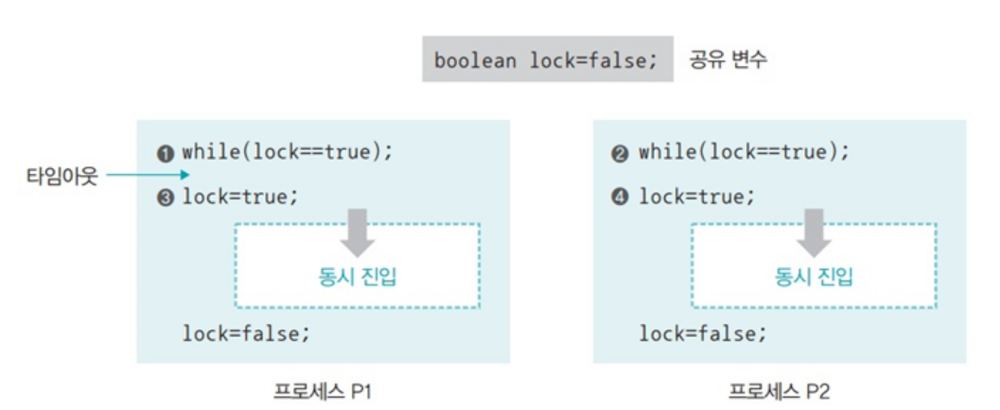
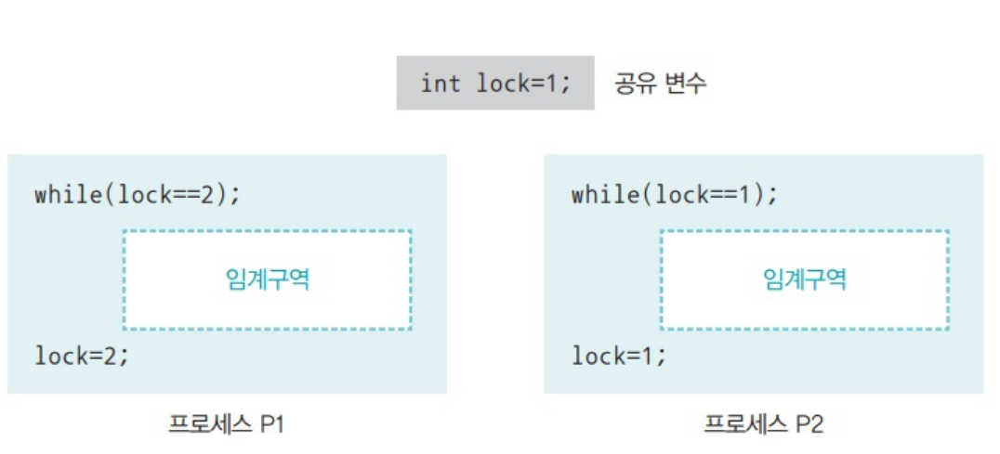
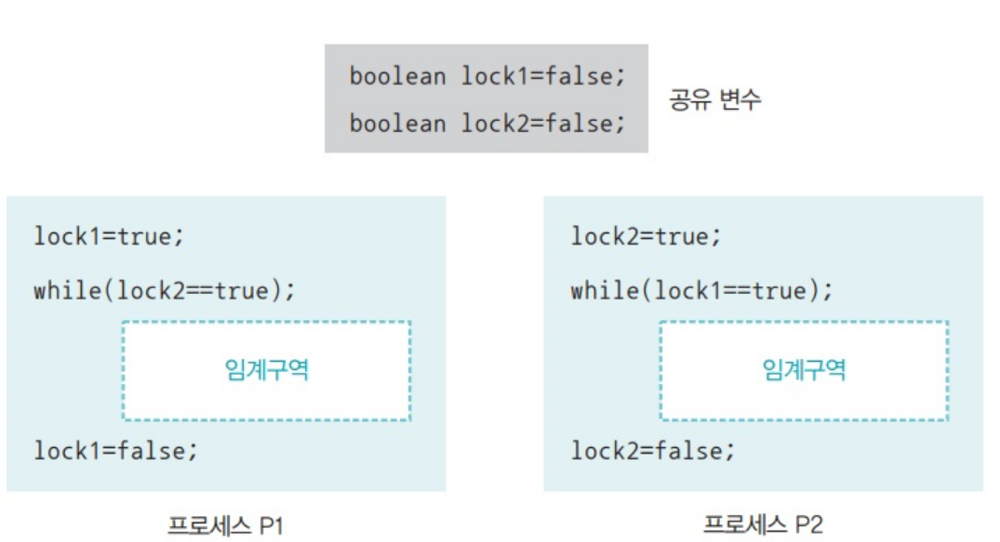
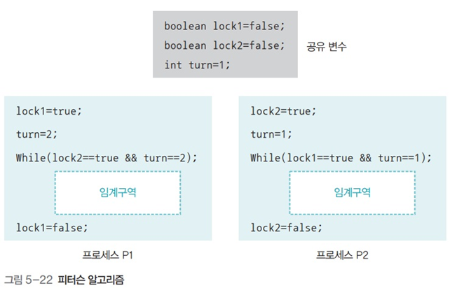
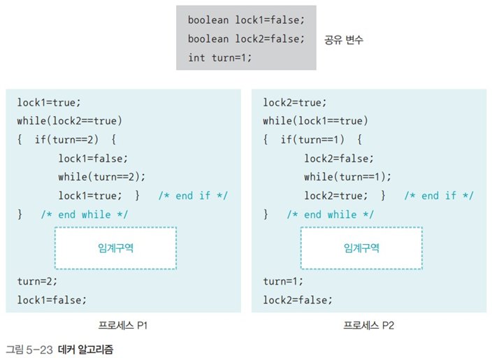

## 프로세스 간 통신
### 프세스간 통신의 개념
- 프로세스와 스레드는 독립적으로 실행함
	- but, 다른 스레드와 협력하기 위해서는 데이터 교환이 필요함
- 스레드간 통신: 같은 프로세스에 속한 스레드간 공유 자원을 이용하여 통신함
- 프로세스는 서로 독립적인 메모리 영역을 가지기 때문에 공유 메모리를 이용하여 통신 할 수 없다
	- 운영체제에서 프로세스간 통신을 지원
		- IPC: Inter Process Communication

#### 프로세스간 통신의 종류
##### 공유 메모리나 고유 파일을 이용한 통신
- 일정한 메모리나 파일을 공유하고 이를 통해서 데이터를 주고 받음
- 프로세스 통신 중 가장 원시적인 방법
	- 데이터 통신 방법을 프로세스끼리 결정하기 때문에

##### 파이프를 이용한 통신
- 운영체제가 제공하는 통신 방법
- 프로세스 간 통신에 가장 많이 사용되는 수단
- 부모-자식 간 통신에 주로 사용

##### 소켓을 이용한 통신
- 컴퓨터와 컴퓨터가 네트워크로 연결된 경우 주로 사용되는 수단
	- 같은 컴퓨터 내에서 사용 가능
		- 하지만 파이프 방식에 비해 자원이 많이 필요하기 때문에 비효율 적임

#### 통신시 고려할 점
- 상대 프로세스를 찾는 방법
- 데이터의 크기
- 데이터의 도착 여부 확인 방법
- etc..

### 프로세스간 통신의  분류
#### 통신 방향에 따른 분류
##### 양방향 통신
- 데이터를 양쪽 방향에서 동시에 전송할 수 있는 구조
- ==일반적인 통신은 양방향 통신을 사용==
	- 소켓을 이용한 통신
##### 반양방향 통신
- 데이터를 양쪽 방향에서 전송할 수 있지만 동시에 전송하지는 못함
	- 특정 시점에 한쪽 방향으로 전송할 수 있는 구조
	- 무전기
##### 단방향 통신
- 한쪽 방향으로만 데이터를 전송할 수 있는 구조
- 공유 메모리, 공유 파일, 파이프 통신에 해당됨
#### 통신 구현 방식에 따른 분류
- busy waiting
	- 데이터를 받는 쪽에서 수시로 확인하는 방식
	- 자원의 낭비가 큼

- synchronization
	- ==운영체제가 데이터가 도착했음을 알려주는 방식==
	- busy waiting의 낭비 문제 해결

- 프로세스간 통신에서 동기화 기능에 따라 구분됨
	- 대기가 있는 통신: blocking communication
		- 동기화를 지원하는 방식
		- 받는 쪽은 데이터가 도착할 때 까지 자동으로 대기 상태에 머무름
		- synchronous communication
		- 통신 기법: 파이프 통신, 소켓 통신
	- 대기가 없는 통신: non-blocking communication
		- 동기화를 지원하지 않는 방식
		- 받는 쪽에서 바쁜 대기를 사용하여 데이터 도착 여부를 확인함
		- asynchronous communication
		- 공유 자원을 이용한 통신

### 프로세스간 통신의 종류
#### 파일을 이용한 통신
- 구성
	- 파일 열기: open()
	- 파일 쓰기 write() or 파일 읽기 read()
	- 파일 닫기: close()

##### 파일 열기
- 열고자 하는 파일의 존재 확인
- 파일을 쓰기 권한 확인
- 파일에 접근 가능한 fd(file descriptor)를 획득
	- fd를 통해서만 파일에 접근 가능하다.

##### 파일 쓰기 또는 읽기
- 파일 접근 권한을 가진 fd를 이용하여 파일에 쓰고 읽음

##### 파일 닫기
- fd가 가리키는 파일을 닫는다.

##### 특징
- 주로 부모-자식 관계의 프로세스 간 통신에서 많이 사용됨
- 운영체제가 동기화를 제공하지 않음
	- 따라서 프로세스가 알아서 동기화해야 한다.
	- 주로 부모 프로세스가 wait()을 이용하여 대기함

#### 파이프를 이용한 통신
- 운영체제가 제공하는 동기화 통신 방식
- ==파일과 같이 open()함수로 기술자를 얻어 작업 후 close()함수로 마무리 한다==
- 양방향 통신을 위해서는 두 개의 파이프가 필요함
	- 프로세스 A -> 파이프 1 -> 프로세스 B
	- 프로세스 A  <- 파이프 2 <- 프로세스 B

##### 이름 없는 파이프와 이름 있는 파이프
- 이름 없는 파이프(anonymous pipe)
	- 일반적으로 파이프가 가리키는 파이프
	- 부모-자식이나 같은 부모를 가진 자식끼리 통신하는데 사용
- 이름 있는 파이프 (named pipe)
	- FIFO라 부리는 특수 파일을 이용하며 서로 관련 없는 프로세스 간 통신에 사용된다.

#### 소켓을 이용한 통신
- 네트워킹
- 인터넷을 이용하여 통신함
	- IP: 컴퓨터 식별 규약
	- TCP: 통신 규약
	- port: 프로세스 구분 주소
- http 데이터를 받는 데몬은 하나임 하지만 사용하는 프로세스는 여러 개임으로 
	- 그래서 소켓을 이용하여 여러 클라이언트를 연결함
	- 데이터 -> 데몬 -> 소켓 -> 프로세스
- 원격 프로시져 호출
- ==소켓은 하나만 있어도 양방향 통신이 가능하다==

## 공유 자원과 임계 구역
### 공유 자원에 대한 접근
- 공유 자원: 여러 프로세스가 공동으로 이용하는 변수, 메모리, 파일등
- 데이터를 읽고 쓰는 순서에 따라 결과가 달라질 수 있음 => 경쟁 조건
	- 공유 자원 접근 순서를 정하여 이러한 문제를 해결함

### 임계 구역
- 임계 구역
	- 경쟁 조건이 발생하는 프로그램의 구역
### 생산자—소비자 문제
- 임계 영역과 관련된 전통적인 예시
- 생산자와 소비자가 별도의 프로세스로 돌아갈때 두 프로세스가 하나의 변수를 이용하여 물건의 갯수를 확인하면 경쟁 조건이 발생하여 개수가 달라질 수 있다.

### 임계 영역 문제 해결 조건
- 다음 3가지 조건을 만족하면 임계 영역 문제를 해결할 수 있다.
#### 상호 배제
- 한 프로세스가 입계 영역에 들어가면 다른 프로세스는 임계 영역에 들어 갈 수 없다.
- 임계구역 내에는 한번에 하나의 프로세스만 있어야 한다.
#### 한정 대기
- 임계구역에 진입하지 못하여 무한 대기 하지 않아야 한다.
#### 진행의 융통성
- 한 프로세스가 다른 프로세스의 진행을 방해해서는 안된다.

## 임계구역 문제 해결 방법
- 단순한 해결 방법은 잠금을 이용하는 것이다.

### 임계구역 문제 해결 조건을 고려한 설계
#### 상호 배제 문제

- 임계구역 진입전 반복문을 이용하여 잠금 여부를 계속 확인한다.
	- 잠금 = 동기화 신호
- 이후 잠금이 풀리면 임계구역 진입전 잠금을 걸고 작업을 진행한다
- 작업을 완료하면 잠금을 해제한다.

##### 문제점
- 임계 구역 접근 가능 시나리오
	- 잠금을 풀린 것을 확인하고 잠금을 걸기 전에 타임 아웃으로 인해 다른 프로세스로 바뀌는 경우 
	- 그럼 다른 프로세스도 확인시 잠금이 풀려있기 때문에 잠금을 걸고 임계구역에 진입할 수 있음
	- 이후 원래 프로세스에 다시 잠금을 걸고 임계 구역에 진입할 수 있다.

> 임계구역에 두 개의 프로세스 접근할 수 있음

- 자원의 낭비
	- 반복문을 사용하여 잠금을 계속 확인하면 대기하기 때문에 불 필요한 자원을 낭비함
	- 

#### 한정 대기 문제

- 프로세스 A 잠금을 가지고 B 잠금을 대기할 때, 다른 프로세스가 B 잠금을 가지고 A 잠금을 대기하는 경우
	- 두 프로세스 모두 잠금을 획득하지 못하고 무한 대기하는 현상이 발생하게 됨
- 잠금의 개수가 늘어날 수록 프로세스가 검사해야하는 잠금의 개수가 늘어남
> 교착 상태: 한정 대기 조건을 보장하지 못하는 상황
> - 프로세스가 살아 있으나 작업이 진행되지 못하는 상태

#### 진행의 융통성 문제

- 잠금의 값을 프로세스 번호로 관리할 경우
	- 프로세스 1이 사용중이면 lock = 1
	- 프로세스 2가 사용중이면 lock = 2
- 각 프로세스는 임계구역 진입 전 반복을 통해서 자신이 사용가능한지 확인한다
- 임계구역에서 빠져 나오면서 다른 프로세스가 사용가능 하도록 lock의 값을 변경한다.

- 위 경우 상호 배제와 한정 대기를 보장하지만 프로세스가 번갈아 가면서 실행되어야 하는 문제가 있음
	- 프로세스 1이 연속으로 임계구역에 진입할 수 없음
	- 프로세스 2가 프로세스 1의 진행을 방해함
		- 경직된 동기화: lockstep synchronization

### 하드웨어 해결 방법
- 잠금 검사와 잠금 설정을 하드웨어에서 원자적인 명령어로 실행하여 중간에 프로세스 전환이 발생하지 않도록 한다.
	- 여전히 바쁜 대기를 사용함

### 피턴슨 알고리즘

- 임계구역 문제를 해결하기 위한 게리 피터슨이 제안한 알고리즘
- 공유 변수 `turn`을 추가하여 하나의 잠금을 획득하고 `turn`을 이용하여 우선 순위를 다른 프로세스에게 양보한다.

#### 한계
- 두 개의 프로세스만 사용 가능하다
	- 여러 프로세스가 사용하기 위해서는 추가적인 공유 변수와 코드가 필요하다.

### 데커 알고리즘

- 하드웨어의 도움 없이 임계구역 문제를 해결할 수 있다.
##### 동작 순선
1. P1이 우선 잠금을 건다
2. P2의 잠금이 걸려 있는지 확인
	1. 걸려 있는 경우 `turn`을 확인하여 이전에 사용했는 확인한다.
	2. 이전에 사용한 프로세스가 P1인 경우 잠금을 해제하고 P2에게 잠금을 넘기고 P2가 끝날때 까지 대기 하고 잠금을 획득하여 임계구역에 진입한다.
3. 결려 있지 않는 경우 임계 영역이 진입
4. `turn`값을 변경하고 잠금을 해제한다.

> [!note]+ 피터슨과 데커 알고리즘의 차이
> - 피터슨: 나중에 잠금을 요청하는 쪽에 무조건 양보하는 단순한 알고리즘
> - 데커: 최근에 사용한 프로세스가 잠금을 양보하고 끝날때 까지 대기하고 재시도하는 공평하게 임계영역에 들어갈 수 있도록 하는 복잡한 알고리즘

### 세마포어
- 다익스트라가 제안한 임계영역 해결 알고리즘
	- 기존 알고리즘의 문제
		- 바쁜 대기를 사용하기 때문에 자원이 낭비됨
		- 알고리즘이 너무 복잡함

#### 장점
- 간단함
- 임계 영역이 잠겨있는지 직접 점검하짐 않므
- 바쁜 대기가 없음
- 다른 프로세스에 동기호 메시지를 보낼 필요가 없음
- 공유 자원이 여러 개인 경우도 사용 가능하다.

#### 주요 함수
- 초기 설정: Semaphore(n)
	- 현재 사용 가능한 자원 수 RS를 저장함
- 사용중 표시 : P()
	- RS가 0보다 크면 1만큼 감소 시키고 0보다 작으면 0보다 커질때 까지 block()
- 사용완료 표시: V()
	- RS를 1만큼 증가 시키고 wake_up() 함수를 이용하여 대기중인 프로세스를 깨운다

> P와 V는 내부 코드는 상호배제와 한정 대기 조건을 보장하지 못함으로 원자적으로 실행할 수 있도록 보장바다야 한다.

#### 동작 방식
- Semaphore(n)를 통해서 초기화
- 임계 구역 진입전 P()를 호출
	- RS가 0보다 큰 경우 임계 영역 진입
	- RS가 0보다 작으면 block()함수를 호출하여 세마포어 큐에서 대기
		- wake_up()함수로 깨어나면 임계 영역 진입
- 임계 영역
- 임계 영역에 나와서 V()함수를 호출하여 임계 영역 사용 완료를 알림
	- RS의 값을 증가 시키고 wake_up()함수를 호출

#### 단점
- 임계 영역이 보호 받지 못한다.
	- 세마포어를 거치지 않고 임계 영역에 접근하거나 세마포어를 잘못 사용해도 접근 가능함

### 모니터
- 공유 자원을 사용할 때 자동으로 세마포어를 적용되도록 구현한 것
	- 공유 자원을 내부적으로 숨기고 접근에 대한 인터페이스만 제공함
		- 공유 자원을 보호
		- 프로세스간 동기화

#### 동작 원리
- 임계 구역을 자원을 직접 사용하지 않고 모니터에게 작업 요청함
- 모니터 큐에 저장후 순서대로 처리하고 결과만 프로세스에게 알려줌

## 파일, 파이프, 소켓 프로그래밍
### 파일
#### 순차 파일
- 파일내 데이터가 한 줄로 길게 저장되어 있는 파일
	- 순차적으로 접근해야함: Sequential access
- 파일 기술자가 현재 파일의 어디를 읽고 있는지 가리킴
	- 처음 열면 맨 앞에 존재
- 파일을 읽고 쓸면 파일 기술자가 전진함

#### 파일을 이용한 통신
##### 사전 지식
- fork()는 파일 기술자도 자식프로세스에게 상속된다
	- 이는 복사되어 사용하기 때문에 close는 각 프로세스 마다 해주어야 함

##### 동작 방식
1. open()을 이용하여 파일 기술자를 초기화함
2. fork를 이용하여 자식 프로세스 생성
	- 자식 프로세스에서 쓰고 부모 프로세스에서 읽음
3. 자식 프로세스에 fd를 이용하여 위치를 이동하며 write()를 이용하여 내용를 작성하고 닫음
4. 부모 프로세스는 자식 프로세스가 완료될때 까지 wait()통해 대기
	- 자식 프로세스가 작성하기 전에 먼저 읽으면 다른 값이 나옴
5. fd를 공유하기 때문에 fd의 위치를 lseek()함수를 이용하여 처음으로 이동
6. 이후 fd를 이용하여 read()를 통해 읽음
7. 부모 프로세스에서 fd를 닫고 종료함

##### 특징
- 파일 통신에서 운영체제가 동기화를 지원하지 않기 때문에 wait()함수를 이용하여 프로세스 알아서 동기화 해야함

### 파이프
- 여기서는 이름 없는 파이프를 가르킴
- 주로 부모—자식 프로세스나 같은 부모를 가진 자식 프로세스끼리 통신할때 사용함
- 파이프도 open()을 이용하여 기술자를 초기화한 후 기술자를 통해서 읽고 쓰기가 진행된다.
	- 다 사용한 후에는 close()를 통해 닫는다.

#### 동작
1. open()을 이용하여 기술자를 초기화함
	- 읽기와 쓰기 기술자가 별도로 필요함으로 2개를 생성한다
		- 하나는 부모에서 자식으로 전달하는 파이프
			- 자식: 읽기
			- 부모: 쓰기
		- 두번째는 자식에서 부모로 전달하는 파이프
			- 자식: 쓰기
			- 부모: 읽기
	- 각 프로세스마다 읽고 쓰기 fd를 생성함으로 4개의 fd가 초기화됨
2. 자식에서 부모로 전달하는 파이프에 fd를 이용하여 내용을 작성
	- 파일과 동일하게 write()를 이용하여 작성
3. 부모 프로세스에서 read()를 이용하여 해당 파이프를 읽음
	- 파일과 다르게 읽고 쓰기 fd를 공유하지 않음으로 fd의 위치를 동기화 할 필요 없음
	- 운영체제에서 동기화를 지원하기 때문에 자식 프로세스가 write하기 전에 read()를 실행하더라도 대기write가 완료될 때까지 대기함

### 네트워킹
- 여러 컴퓨터에 있는 프로세스끼리 데이터를 전달하는 방법중 가장 대중화된 방법임
- 파일과 파이프와 동일하게 open, close, read, write 구조를 사용

#### 동작
##### 클라이언트
1. socket(): 소켓을 생성
2. connect(): 소켓을 이용하여 서버의 IP와 포트 정보에 연결
3. read/write(): 데이터를 읽고 씀
4. close: 소켓을 닫음

##### 서버
1. socket(): 소켓을 생성
2. bind(): 특정 포트에 소켓을 등록
3. listen(): 클라이언트를 받을 준비함
4. accept(): 클라이언트의 connect()를 받음
	- 해당 클라이언트와 통신하는 새로운 소켓을 복제하여 생성함
5. read/write(): 데이터를 읽고 씀
6. close(): 소켓을 닫음
