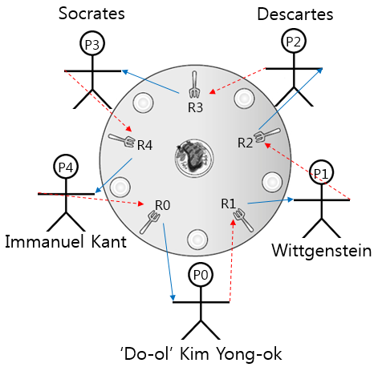

## 교착 상태의 정의
- 교착 상태
	- 다른 작업이 끝나기만 기다리며 작업을 더 이상 진행하지 못하는 상태
		- P1 프로세스가 A 잠금을 들고 B 잠금을 대기하지만 P2 프로세스가 B잠금을 들고 A 잠금을 대기하면서 P1, P2 모두 실행하지 못하는 교착 상태에 빠짐

- 발생하는 상황
	- 시스템 자원
		- 두 프로세스가 동시에 사용할 같이 사용할 수 없는 자원들은 서로 양보하지 않고 대기하는 경우
	- 잠금
		- 다른 잠금을 기다리면 무한 대기하는 경우

### 자원 할당 그래프
- 프로세스가 어떤 자원을 사용 중이고 어떤 자원을 기다리는지를 방향성 그래프로 나타낸 것
- 프로세스는 원, 자원은 사각형으로 표시
	- 2개 이상의 프로세스를 동시 허용하는 다중 자원은 사각형안 작은 동그라미로 표현 한다.

### 식사하는 철학자 문제
- 교착 상태를 성명하기 위한 대표적 예시

## 교착 상태 필요 조건
### 교착 상태 필요 조건
- 4가지 필요 조건을 동시에 만족해야만 교착 상태가 발생한다.
#### 상호 배제
- 한 프로세스가 사용하는 자원을 다른 프로세스와 공유할 수없는 베타적 자원이여아 한다.
#### 비선점
- 한 프로세스가 사용 중인 자원은 중간에 다른 프로세스가 빼앗을 수 없는 비선점 자원이어야 한다.
#### 점유와 대기
- 프로세스가 어떤 자원을 할당받은 상태에 다른 자원을 기다리는 상태여야 한다.
#### 원형 대기
- 점유와 대기를 하는 프로세스 간의 관게가 원을 이루어 한다.
## 식사하는 철학자 문제와 교착 상태 필요 조건
#### 상호 배제
- 포크는 한 사람이 사용하면 다른 사람이 사용할 수 없는 베타적 자원이다
#### 비선점
- 포크를 다른 사람이 사용중이면 다른 사람이 포크를 뺏을 수 없다.
#### 점유와 대기
- 포크를 가질 때까지 포크를 들고 대기함
- 현재 작업을 진행하는 쪽과 기다리는 쪽의 선후 관계가 만들어지는 경우
#### 원형 대기
- 식사하는 철학자들은 둥근 식탁에서 식사를 한다.
- 선후 관계를 결정할 수 없어 계속 대기하는 경우

## 교착 상태 해결 방법
- 교착 상태를 해결하는 방법은 예방, 회피, 검출, 회복이 있다.
	- 예방: 교착 상태를 유발하는 4가지 조건 중 하나가 발생하지 않도록 막는 방법
	- 회피: 교착 상태 유발 가능성을 확인하고 자원 할당을 조절함
	- 검출: 교착 상태가 발생하는 살펴보는 방식 - 별다른 조치는 하지 않음
	- 회복: 교착 상태가 발생하면 사후처리 하는 방식

### 교착 상태 예방
#### 상호 배제 예방
- 모든 자원을 공유하도록 한다
> 시스템 내에서 자원을 공유하는 경우 문제가 발생할 수 있기 때문에 상호 베제를 무력화하기는 사실상 어렵다.
#### 비선점 예방
- 모든 자원을 뺏앗을 수 있도록 한다.
> 시스탬 내 모든 자원을 뺏앗는 경우 상호 배제를 보장할 수 없고 아사 문제가 발생할 수 있어 무력화하기 어렵다.
#### 점유와 대기 예방
- 자원을 점유한 상태로 다른 자원을 기다리지 못하도록 한다.
	- all or nothing
		- 모든 자원을 한꺼번에 점유하거나 그렇지 못할 경우 모두 반납해야함
- 프로세스의 자원 할당 방식을 변경하여 교착 상태를 처리함
- 단점
	- 프로세스가 자신이 사용할 모든 자원을 미리 알기 어렵다
	- 자원의 활용성이 떨어진다
		- 당장 사용하지 않은 자원을 선점하여 다른 프로세스의 작업을 지연시킬 수 있음
	- 많은 자원을 사용하는 프로세스가 불리함
		- 모든 자원을 얻을 확률이 줄어들어 아사 현상을 유발 할 수 있다.
	- 일괄 작업 방식으로 동작한다.
		- 입출력 장치와 같이 대부분의 프로세스가 공유하는 자원들을 순차적으로 사용하면 일괄 작업 방식으로 처리되어 비효율 적이다.
#### 원형 대기 예방
- 점유와 대기를 원형을 이루지못하도록 막는 방법
	- 자원에 순서를 지정하여 순서대로 할당해 가는 방식
	- 자원을 한 방향으로 사용하도록 설정하여 원형 대기를 회피
- 단점
	- 유연성이 떨어진다.
		- 자원을 사용하는 순서가 정해져 있음
	- 자원에 번호를 부여하는 방법 문제
		- 번호가 큰 자원을 사용후 번호가 작은 자원을 사용할 수 없음으로 자원 번호를 적절하게 부여해야함
### 교착 상태 회피
- 시스템의 운영 방식에 변경을 가하지 않기 때문에 교착 상태 예방보다 더 유연함
- 교착 상태가 발상하지않는 범위 내에서 자원을 할당하도록 조절하는 방식
	- 안정 상태
		- 시스템이 어떤 순서로든 프로세스들이 요청하는 모든 자원을 교착 상태를 야기하지 않고 차례로 모두 할당해줄 수 있는 상태
	- 불안정 상태
		- 교착 상태가 발생할 가능성이 있는 상태

- 프로세스가 자원을 요청하면 시스템은 해당 요청 수락 시, 그 다음의 상태가 안정 상태로 유지될 것인가 여부를 미리 검토
	1. 만약 계속 안정 상태에 머무르게 된다면 그 요청을 수락
	2. 그렇지 않다면 그 요청은 허락이 안 된 채 다른 프로세스가 끝나기까지 대기

#### 은행원 알고리즘

- 사용 변수
	- 전체 자원: 시스템 내 전체 자원의 수
	- 가용 자원: 전체 자원 - 모든 프로세스의 할당 자원
	- 최대 자원: 각 프로세스 필요한 자원
	- 할당 자원: 각 프로세스에 할당된 자원
	- 기대 자원: 최대 자원 - 할당 자원

- 각 프로세스의 기대 자원과 비교하여 가용 자원이 하나라도 크거나 같으면 자원을 할당
- 가용 자원이 어떤 기대 자원보다 크지 않으면 자원을 할당하지 않음

#### 교착 상태 회피의 문제점

> 다음과 같은 문제로 실제 시스템에서는 사용하지 않는다.
##### 프로세스가 자신이 사용할 모든 자원을 미리 알아야함
- 모든 프로세스가 자신이 사용할 자원을 미리 선언 해야함
- 미리 선언한 자원이 정확하지 않으면 교착 상태를 회피를 할 수 없음
##### 시스템의 전체 자원의 수가 고정되어야함
- 시스템의 자원의 수는 고장이 추가로 인해 유동적으로 바뀔 수 있음
##### 자원의 낭비가 발생함
- 모든 불안정 상태가 교착 상태가 되는 것은 아님. 따라서 불완전 상태를 피하기 위해서 자원을 할당하지 않는 것은 자원 낭비임
- 프로세스는 최대 자원의 개수만큼 사용하지 않고 작업을 완료할 수 있음
	- 할당되었지만 사용하지 않는 자원이 낭비됨

### 교착상태 검출
#### 타임 아웃
- 일정 시간동아 작업이 진행되지 않는 프로세스를 교착 상태가 발생한 것으로 간주하여 처리하는 방식
	- 교착상태가 자주 발생하지 않을 것이라는 가정
	- 구현하기 쉽고 처리할 작업이 작음
		- 가벼운 교착 상태 검출

##### 타임 아웃의 문제점
- 엉뚱한 프로세스가 강제 종료될 수 있음
- 모든 시스템에 적용할 수 없음
	- 교착상태가 발생하면 매우 위험한 시스템도 존재: 원자로 제어 시스템, 무기 제어 시스템

> 일반 사용자가 사용하는 운영체제에서는 교착상태를 찾기 위해 일일이 탐색하는 것보다 교착 상태가 발생하면 타임 아웃 프로세스 죽이는 것이 더 효율적임
> - 유닉스와 윈도우 같은 대중 운영체제에서는 타임아웃 방식을 사용

##### 데이터베이스의 교착상태
- 타임아웃으로 인해 프로세스가 종료되면 일부 데이터에 문제가 발생할 수 있음

- `roll back`과 `check point`를 이용하여 문제가 발생하면 저장된 상태로 되돌아가 데이터의 일관성을 유지
	- 스냅숏: 체크 포인트는 작업을 하다가 현재 시스템 상태를 저장한 데이터
#### 자원 할당 그래프를 이용한 교착 상태 검출
- 자원 할당 그래프에서 사이클 존재 여부를 확인하여 교착 상태가 있는지 확인하는 방식
	- 하지만 다중 자원을  사용하는 경우 사이클이 있다고 무조건 교착상태인 것은 아님

##### 문제점
- 자원 할당 그래프를 유지하고 갱신하기 위한 오버헤드가 발생함

### 교착 상태 회복
- 교착 상태가 검출되면 교착 상태를 푸는 후속 작업

##### 교착 상태를 발생시킨 모든 프로세스 종료
- 교착 상태를 발생시킨 모든 프로세스를 동시에 다시 시작하면 다시 교착 상태에 빠질 수 있기 때문에 순차적으로 실행한다
	- 프로세스 실행 순서에 대한 기준이 필요함
##### 교착 상태를 발생시킨 프로세스중 하나를 골라 순차적으로 종료
- 하나씩 순차적으로 종료하면서 나머지 프로세스의 상태를 파악하면서 종료
	- 우선순위가 낮은 프로세스를 먼저 종료
	- 우선순위가 같으면 작업 시간이 짧은 프로세스 종료
	- 두 조건이 같으면 자원을 가장 많이 사용하는 프로세스를 종료

> 강제종료된 프로그램을 실행하기전 시스템을 복구하는 작업도 해야함
> - 주로 체크포인트를 만들어 가장 최근의 검사 시점으로 돌아가는 식으로 복구를 진행함
> - 이 방법은 작업량이 많기 때문에 체크포인트를 무분별하게 사용하지 말고 선택적으로 사용해야함