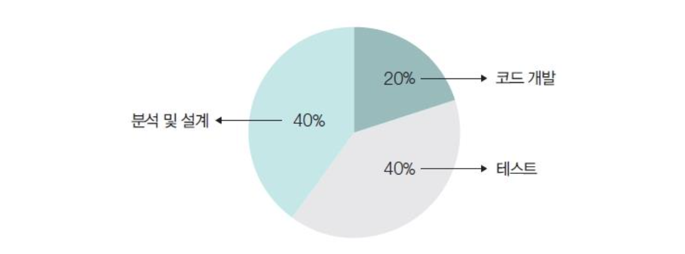
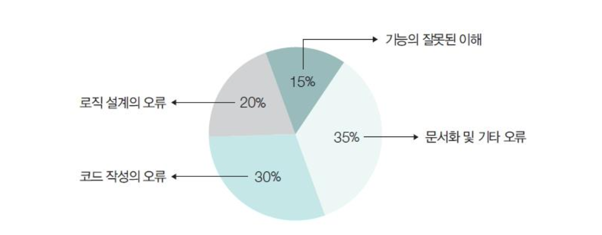
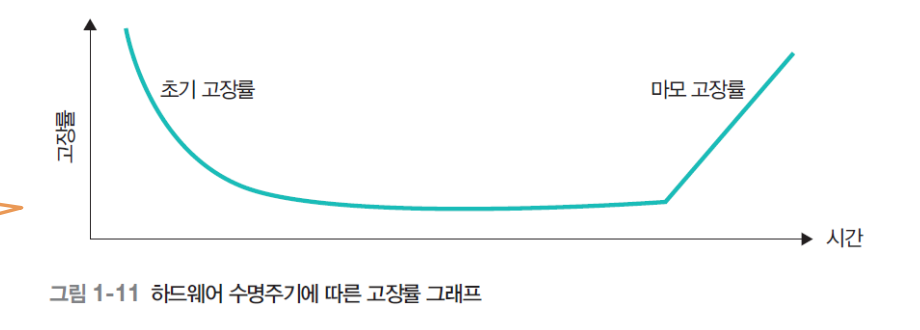
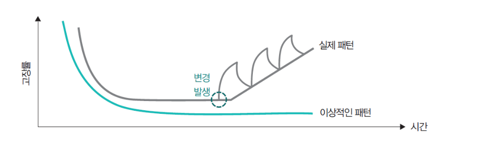
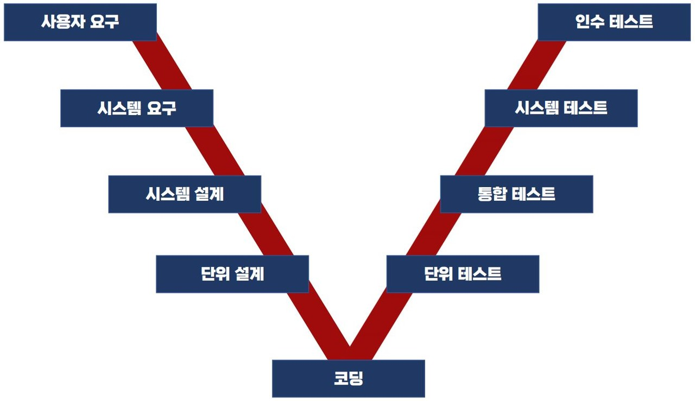
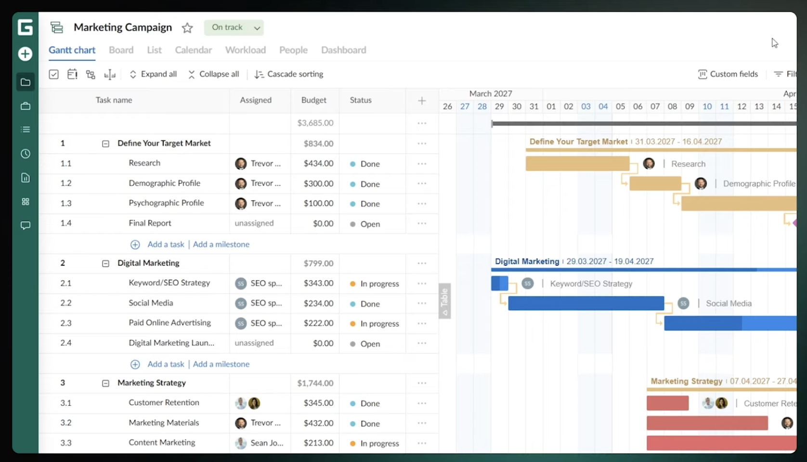
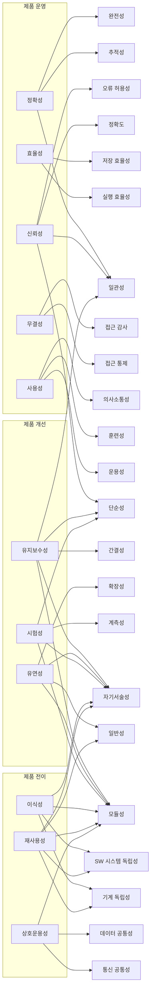

# 소프트웨어 고장 사례
### MCO 위성 결함 사례
- 위성의 속도 변화를 계산하는 프로그램의 계산 단위의 차이로 발생한 오류가 위성 전체에 전파
	- 그냥 원시 int가 아닌 Value Object를 사용했다면 이런 문제가 없지 않았을까?
		- 실제 문제는 인터페이스는 두 조직(록히드 마틴과 JPL)이 만든 별개 시스템 사이의 파일/데이터 교환에서 발생한 문제임
		- VO는 한 프로그램 내부에서는 의미가 있지만 외부 프로그램사이에서는 효과가 없음
	- 왜 테스트 안함? 테스트 하면 이런일 없었을 거 아님
		- 담당직원이 불일치를 인지하고 보고했으나 보고서 양식이 맞지 않다는 이유로 기각당함 

## Jeep Cherokee 해킹 사건
- 개요
	- D-Bus 리눅스 계열 OS에서 프로세스들 간의 메시지를 전달하는 데몬?서비스
	- 6667번 포트: IRC 통신에 할당된 표준 포트
		- IRC: 인터넷 실시간 채팅 프로토콜
	- CAN(Controller Area Network): 차량에서 모듈간의 통신을 방법
	- SPI(Serial Peripheral Interacre): 칩과 칩 사이 데이터를 빠르게 전달하는 통신 방식
		- 여기서는 차량의 메인 OS와 차량을 차량 부품을 통제하는 V850칩을 연결하는데 사용
- 순서
	1. 차량의 IP 주소 찾기
	2. Sprint 네트워크를 통해서 차량의 6667번 포트로 메시지 전송
		- D-Bus 6667번 포트가 외부로 노출되어 있기 때문에 사용가능
		- 취약점
	3. D-Bus를 이용하여 높은 권한을 가진 프로세스에 명령어를 전달
		- root를 탈취하거나 프로세스를 실행하거나 파일 쓰기 읽기 가능
		- 익스플로잇
	4. 메인 -> SPI -> V850 -> 자동차 모듈 로 데이터 전송이 가능해짐

### CAN이란
- 등장 배경: 자동차에서 사용하려고 만듬
	- 기존에 비동기 직렬방식을 사용하여 모듈가 1대1 통신만 지원함
		- 모듈이 늘어날 수록 연결 수가 비악적으로 늘어는 문제
- 메르세데스 벤츠가 보쉬한데 만들라고 함
	- 하나의 버스위에서 모듈끼리 통신하는 방식 (like 과거 동축 케이블 시절 이더넷=> 지금은 스위치가 라우팅 해줌)
		- 뭐가 다른가? CAN은 우선순위에 따라 데이터를 정확하게 보내는데 초점
			- 그래서 최대 속도가 1Mbps이고 8바이트 전송
			- CSMA/CR 기법 사용
				- 비트:  1  1  0  1  1  0  ...
				- 노드 A (ID a): 1  1  0  0  ...        → 4번째 비트에서 패배(0 보냈으나 양보 아님, 아래 정정)
				- 노드 B (ID b): 1  1  0  1  1  0  ...  → 승리
				- 노드 C (ID c): 1  1  1  ...           → 3번째 비트에서 패배
					- 위 우선순위를 ID를 통해서 결정됨
						- 데이터 구조 
							- SOF - ID - .... - EOF
				- 위 방식을 위해서 항상 읽는 장치와 쓰는 장치가 있음
					- 지가 보내고 지가 읽고 있음
				- 반이중(half Duplex) 방식임
				- 가장 강한(우선순위가 높은) 신호가 모든 모듈에 전달됨
		- 이더넷을 대량을 데이터를 빠르게 보내는데 초점
			- 요즘 데이터 많이 쓰는 ADAS에서는 쓴다고함 
- 사용하는 이유
	- 빠르다
	- 노이즈에 강하다
	- 우선순위에 따른 처리가 가능하다
		- 자동차에서는 와이퍼 신호보다 브레이크 신호가 먼저 전달되어야 하기 때문
	- 노드 늘어나도 연결의 수가 선형적으로 증가
## 보잉 737 MAX 8의 MCAS 오작동
- MCAS는 보잉 737을 업그레이드하기 위해서 엔진을 위치를 뒤로 옮기면서 항공기의 노즈가 지나치게 높아지는 문제를 소프트웨어를 이용하여 자세를 제어하기 위해 만듬
- 문제점
	- 비행기에서는 2개의 노즈 센서가 있지만 MCAS는 하나의 센서만 이용하여 노즈의 각도를 변경함
		- => 센서에 문제가 있어도 그대로 사용함
			- 2개의 센서값을 사용하도록 변경
				- 2개 값다 고장나면 똑같은 꼴아박는거 아님?
				- redundancy의 중요성

## 테슬라 모델 S의 사고
- 테슬라의 오토파일럿이 흰색 트레일러의 측면은 인식하지 못하고 그대로 가져다 박아 발생한 사망 사건

## 클라우드 플레어의 25년 11월 18일 6시간 장애 사건
1. 데이터베이스 권한 변경: ClickHouse에서 암묵적 권한을 명시적으로 바꾸는 작업
2. 쿼리가 r0의 메타데이터까지 반환: DB 이름 필터가 없던 쿼리가 default + r0 양쪽 컬럼을 가져옴
3. 피처 파일이 두 배로 비대해짐: 중복 행 때문에 피처 수가 한도(200개) 초과
4. 비대해진 파일이 전 세계 모든 프록시 서버로 배포됨: 이 파일은 5분마다 재생성되어 네트워크 전체에 전파되는 구조
5. 각 프록시 내부의 봇 관리 모듈이 파일 로드 실패: 200개 한도 초과로 에러 반환
6. 에러 처리 미흡 에러 반환 → 프록시 프로세스 크래시
7. 그 프록시를 지나던 모든 트래픽에서 5xx 에러 발생

---
# 소프트웨어 위기
## 등장
- 소프트공학 초기에 출현한 용어
	- 컴퓨터에 의한 계산 요량과 문제의 복잡성이 급격히 증가함에 따라 발생한 충격
- 본질적으로는 정확하고 이해할 수 있고 검증 가능한 컴퓨터 프로그램을 작성하는 것이 얼마나 어려운가를 의미한다.
- 소프트웨어의 발전이 하드웨어의 성능 발전을 따라가지 못함
- 1980년대에는 개발 프로젝트의 성공률 16% -> 2009년 32%까지 2배 늘어나
	- BUT, 재작업 후 배포와 배포되지 않는 경우의 수는 감소하지 않음
	- 그 이유는 소프트웨어가 점점 복잡해지고 사용자의 요구가 다양해지고 있기 때문에
## 소프트웨어 위기의 원인과 증상
### 원인
- 소프트웨어 대형화 및 복잡화에 따른 개발 비용 증강
- 급격한 하드웨어 기술을 따라가지 못하는 소프트웨어 기술
- 소프트웨어 가격 상승폭 증가
- 유지보수의 어려움과 개발 정체 현상
- 신기술에 대한 교육및 훈련 부족
- 빈번한 요구사항 변경 및 반영
### 증상
- 예산 초과
- 일정 지연
- 낮은 품질
- 비효율적 개발
- 요구사항 불만족
- 산출물 관리의 여러움

## 소프트웨어 개발이 어려운 이유
1. 의사소통의 문제
	- 사용자, 개발자, 품질 관리자, 마케팅, 스폰서가 모두 자신의 언어를 사용하여 소통
	- 소통의 오류 발생 => 소통의 양 증가
2. 시스템의 순차 특성
	- 개발 2차원 -> 실행은 3차원
3. 개발에 의한 결과물
	- 개발자의 경험과 지식, 노화우에 따른 다른 결과
4. 프로젝트의 복잡한 특성
	- 개발 기간
	- 적용되는 기술
	- 참여하는 개발자의 수
	- 프로젝트의 목적
	- => 위 특성에 따라 동일한 개발 프로세스를 적용하기 어려움
5. 개발자의 특성
	- 개발자들 간의 협업
	- 개발환경에 따른 개발자의 능력 변환
6. 다양한 관리 이슈
	- 요구사항, 일정, 리스크, 산출물, 버전, 기타 등등
	- => 협업을 위한 세부 관리를 위한 노력
	- 팀원들간의 공통의 목표 정렬이 필요
---
## 소프트웨어 특성 정보
- 소프트웨어 개발과 관련하여 고려해야하는 특성
### 개발 비용
- 분석및 설계 : 코드 개발 : 테스트 = 40 : 20 : 40
- 코드 개발 보다 테스트와 설계가 더 중요함

### 개발 및 유지보수
- 운영 유지 : 개발 비용 = 67 : 33
- 소프트웨어 개발보다 개발된 소프트웨어를 수정하고 개선하기 위한 노력이 더 많이 요구됨
- 운영 유지 비용 절감 방안을 중요하게 고려

### 개발시 오류의 근원
- 코드에 숨겨진 잠재적 오류나 문서화의 불일치는 쉽게 고쳐지지 않음 => 발견하기 어렵다

### 고장
- 하드웨어
	- 초기
		- 성능 조정과 테스트를 통해 오류를 수정하여 고장률을 최소로 감소시킬 수 있다
	- 후기
		- 시간이 지남에 따라 마모되거나 낡아서 성능 저하로 인한 고장률이 늘어난다

- 소프트웨어
	- 초기
		- 하드웨어와 마찬가지로 오류 수정을 통해서 고장률을 최소로 감소시켜 출시
	- 후기
		- 하드웨어처럼 마모되는 특성은 없지만 변경에 따른 고장률이 변화한다
		- 하드웨어는 한번 설치하면 변경하기 어렵지만 소프트웨어는 비교적 변경이 쉬움
			- 따라서 성능 개선을 위한 변경이 발생함
			- 변경이 반복되면 소프트웨어의 구조가 복잡해지고 로직이 엉킴
			- 그럼 하드웨어와 유사한 고장 그래프를 보임

> 운영 과정에서 변경으로 인해 소프트웨어 구조가 복잡해 지지 않도록 체계적인 공학적 기법이 적용되어야 함

## 인공지능 시대의 소프트웨어 위기
- 4차 산업 혁명 : 정보 혁명
	- 초연결: 객체간의 상호 연결
	- 초융합: 이종 기술, 산업간 결합
	- 초지능: 더 나은 지적 역량을 제공

- 지능 소프트웨어 개발의 남발
	- 학습 알고리즘이 무분별하게 응용 소프트웨어 개발에 적용되고 있음
		- 적합한 알고리즘인지
		- 어떤 입력을 구성하여 제공하는지
		- 최적의 해를 결정하기 위한 정책이 올바르게 적용되는지
	- 충분한 검토 없기 기계학습 알고리즘이 사용되고 있음 

- 지능 소프트웨어 사고 위험
	- 기계는 사람보다 올바르고 신속한 솔루션을 제공할 확률이 매우 높음
		- 하지만 입력 데이터의 약간의 변형에도 다르게 인식하는 경우가 많음
	- 증권에서 오류를 발생하는 경우 -> 금전적 손실
	- 자율 주행에서 오류가 발생하면 -> 재산 손실 + 인명 피해
		- 테슬라 저격?
	- 자동차 조립에서 오류가 발생하면 -> 재산 손실 + 인명피해
		- 2015년 폭스바겐에서 로봇에 의한 엔지니어 사망사고

# 소프트웨어 공학 기술의 적용
- 소프트웨어의 공학적 기술을 적용하여 소프트웨어의 위기를 해소하고 안전한 소프트웨어 개발을 도모한다

## 소프트웨어 공학적 기법의 종류
- 구조적 프로그래밍
	- 프로그램을 좀 더 이해하기 쉽고 논리를 체계적으로 표현할 수 있는 공학적 접근 방법
	- 다익스트라
		- 순차-반복-선택 => 프로그램 기본 구조
	- 디마크로 / 페이지 존슨
		- 분석 및 설계 단계에서 모듈화의 개면과 단계적 상세화 개념을 제시하여 설게에 대한 구조화를 제안
- 객체지향 프로그래밍
	- Simula-67에서 처음 클래스라는 개념이 도입
		- 절차적 언어 ALGOL 60에 객체지향 개념을 추가
	- 진정한 객체지향 언어로 평가되는 Smalltalk 개발
		- "모든 것이 객체이고 모든 것이 메시지"라는 단일하고 순수한 패러다임으로 완성시킴
	
	- 클래스 개념을 기반
		- 캡슐화, 정보은닉, 상속, 다형성등 개념을 제공
	- 소프트웨어를 직관적으로 이해하고 유지보수 및 재사용을 쉽게 할수 있도록 지원

- 소프트웨어 컴포넌트 재사용
	- 기존의 코드 묶음을 컴포넌트로 명세하고 재사용하기 위한 시도
	- 기존 코드를 재사용하면서 
		- 개발 시간 단축
		- 컴포넌트를 조립하여 대규모 소프트웨어 개발을 
		- 기존의 검증된 코드 사용 가능

- 통합 개발 환경
	- 개발에 관련된 일련의 작업을 하나의 프로램안에서 처리 하는 통합 소프트웨어  개발 환경

- 소프트웨어 프로토타이핑
	- 최종 소프트웨어 개발이 완료되기 전 소프트웨어를 사전에 보여줌으로써 사용자의 요구사항을 명확히 반영하고 확정하기 위함

- 소프트웨어 개발 프로세스
	- 폭포수 모델: 요구사항 -> 분석 -> 설계 -> 코딩 -> 테스트 -> 배포
	- 점진적 개발 방식
		- 프로토타입 개발방식
			-  요구사항이 불명확하거나 개발자와 사용자 간 요구사항 이해 차이로 인한 오해를 해결하기 위해서
			- 동작하는 견본을 통해 요구사항을 조기에 확정하고 개발 후반의 대규모 수정을 방지.
		- 나선형 개발 방식
			- 계획 → 위험 분석 → 개발 및 검증 → 고객 평가의 단계를 나선형으로 반복
			- 매 주기마다 위험을 평가하고 점진적으로 시스템을 완성하는 방식.
			- 반복 주기마다 위험을 관리하여 대규모, 고비용 프로젝트에서 실패 가능성을 최소화하고 프로젝트를 안정적으로 진행
		- V모델
			- 
			- 개발 단계와 각 단계에 대응하는 테스트 단계를 V자 형태로 짝지어 진행하는 방식
				- 대응되는 테스트에 어떻게 평가 할 것인지 미리 고민
			- 폭포수 모델을 확장한 형태로 테스트가 후반에 몰려 결함 발견이 늦어지는 문제를 해결
			- 각 개발 단계마다 검증/확인을 명확히 연결하여 결함을 조기에 발견
		- 애자일 개발 방식
			- 짧은 주기로 개발과 배포를 반복
			- 변화하는 요구사항에 유연하게 대응하는 방식
			- 서보다 동작하는 소프트웨어와 고객 협업을 중시
			- 빠른 피드백과 반복을 통해 고객 가치를 신속히 전달하고 변화에 유연하게 적응.
		- DevOps 개발 방식
			- 개발과 운영을 통합
			- CI/CD 자동화를 기반으로 개발-배포-운영을 끊김 없이 연결

- 소프트웨어 검사 및 검증
	- 소프트웨어가 거대해 짐에 따라 결함없는 소프트웨어를 만들기 어려워짐
	- 체계적으로 설계 개발된 테스트 케이스를 이용하여 개발된 소프트웨어를 동작을 확인하고 잠재된 결함을 최대한 찾음

- 소프트웨어 형상 관린
	- 발생한 변경을 어떻게 잘 처리하고 관리할지
	- 소프트웨어의 변경이 언제 어디서 발생했는지를 기록하고 관리

- 소프트웨어 아키텍처
	- 소프트웨어의 생명 주기가 길어지면서 많은 변화가 발생함
	- 이러한 변화를 체계적으로 쉽게 반영할 수 있는 소프트웨어를 구조를 가질 수 있도록 소프트웨어를 개발해야함
		- 변경에 강한 코드를 작성해라

## 소프트웨어 공학의 정의와 원리
### 정의
- 소프트웨어의 설계, 구현, 테스트, 문서화를 위한 과학적이고 기술적인 지식, 방법, 경험의 체계적인 적용
	- 과학적 => 객관적인 근거와 검증을 통해 얻어진 지식
	- 기술적 => 어떤 일을 실제로 해내기 위한 구체적인 방법

### 원리
- 엄격성과 정형성
	- 누구나 동일한 의미로 해석할 수 있는 정형성 -> 엄격성
- 관심사의 분할
	- 복잡한 다차원 요소 => 관심사 분리 => 복잡함 해소
- 모듈화
	- 독립적인 기능을 수행하는 작은 단위
	- 쉽게 분리하거나 조합 할 수 있어야 한다
		- 결합도는 낮추고 응집도는 높혀야 한다.
			- 결합도: 두 루틴이 얼마나 밀접하게 연결되어 있는지
			- 응집도: 모듈 안에서 요소끼리 얼마나 밀접하게 연결되어 있는지
- 추상화
	- 세부적인 사항들을 감추고 대상물의 특징으로 사물을 대효하도록 정의하는 원리
	- 관심사를 잘 표현하기 위하여
- 변경의 예측
	- 개발 과정에서 변겨의 발생은 피할 수 없음
	- 변경이 발생할 것으로 예측되는 부분에 대해서는 모듈화 구조를 통한 분리가 필요하다.
- 일반화
	- 다양한 환경에서 사용할 수 있도록 최대한 정형화 하는 공동 활용성을 높이고자 하는 원리
- 점진성
	- 소프트웨어는 단계적이며 순차적으로 개발하도록 하는 원리
- 명세화
	- 개발 과정에서 생성되는 정보를 체계적으로 기술하는 것
	- 유지보수를 위해 소프트웨어 명세를 남기는 것

> 변화의 영향을 제한해야 한다
> 
> 엄격성과 정형성 -> 관심사 분리 -> 추상화 -> 모듈화 => 영향을 제한
> 일반화 => 환경에 대한 영향 제한
> 점신성 => 변화의 주기를 최소화
>  명세화 => 변화를 기록

# 소프트웨어 품질의 중요성
- 소프트웨어 품질 향상 == 관련자(사용자, 개발자, 유지보수자, 마케팅 관리자)의 기대치 만족
## 소프트웨어 품질의 정의
- 건출물을 칮는 활동과는 사뭇 다르게 고려될 수 있다
	- 진짜 다른가? 
		- 물리적으로 존재한다고 품질을 보증할 수 있나?
		- 사용자가 설계도면 가져오는 경우가 있나?
- 명시적인 기능 및 성능 요구사항, 명시적으로 문서화된 표준, 개발된 소프트웨어에서 기대되는 묵적인 특성에 대한 정합성
### 생상 공학과 설계 공학
- 다리는 짖는 공학는 생산 공학에 속한다.
- 생산 공학은 물리적 대상을 다루기 때문에 
	- 물건들을 일정 수준의 정확도와 품질로 만들어야 하고, 
	- 정해진 시간과 예산 안에 특정 장소로 운반해야 하기도 합니다. 
	- 모델과 설계가 현실과 맞지 않을 때는 이론적 아이디어를 실제 상황에 맞게 조정해야 하죠.

> 하지만 디지털 결과물에는 이런 문제가 거의 없거나 아주 간단하게 해결할 수 있습니다

- 생산 공학은 생산 과정의 여러 어려움이 모두 생긴다.
- 생산에서 실패는 곳 매우 큰 리스크이다.
	- 다리를 짖다가 실수하면? => 붕괴 사고
	- 휴대폰을 생산하는데 실수하면? => 리콜
	- 이 분야의 엔지니어들은 주로 모델링 기법을 사용합니다. 
	- 작은 모형을 만들기도 하고, 요즘은 컴퓨터 시뮬레이션이나 다양한 수학적 모델을 쓰기도 합니다

- 소프트웨어의 생산은 딸깍이다. 생산의 비용이 거의 무료에 가깝다.
	- 소프트웨어는 실수가 가능하다
		- 바꾸는 데 드는 비용을 신경 쓰지 않아도 됩니다
- 작은 실패의 반복을 통해서 유의미한 피드백을 만들어야한다.

### 소프트웨어 품질이 중요한 이유
- 소프트웨어 품질 목표 달성 == 관련자들이 원하는 방향의 소프트웨어
	- BUT, 관련자들 간의 관점 충돌이 발생할 수 있다. => 적절한 타협점을 찾아야 한다
- 기능이 복잡해짐 => 개발의 복잡도 증가 => 오류 증가 => 품질 저하
	- 기능이 안복잡하면 되는 거 아님?
		- 모듈화
		- 일반화
		- 추상화
		- ....

# 소프트웨어 품질 요소
- 소프트웨어 품질 == 요구에 대한 접합성
- 관계자별 요구 사항
	- 스폰서
		- 낮은 비용
		- 적용성
		- 재사용성
		- 비용 효율성
	- 사용자
		- 정확성
		- 신뢰서
		- 사용성
		- 낮은 비용
	- 유지보수자
		- 가독성
		- 코딩표준 준수성
		- 프로그램 구조
		- 검증 가능성
		- 문서화
- 위 요구사항에 대한 만족여부를 판단하는 방법???
## 외적 품질 요소
- 정확성 (Correctness)
	- 사용자가 제시한 요구사항 명세에 따라 동작하는 정도
	- 기준이 되는 사용자의 요구사항이 모호하면 안됨

- 신뢰성 (Reliability)
	- 소프트웨어를 사용하는 동안 나타나는 오류 발생의 정도
	- MTBF (Mean Time Between Failure)로 나타낼 수 있다
		- MTBF = 10_000 H이면 10_000시간 동안 고장이 없다

- 견고성 (Robustness)
	- 요구사항 명세에 정의하지 않은 조건이나 환경에서도 합리적으로 동작해야 한다

- 성능 (Performance)
	- 실행에 요구하는 자원의 양
		- 메모리, 실행 시간 등

- 사용자 친숙성 (User Friendliness)
	- 사용자가 소프트웨어를 사용하기 편리한가를 나타내는 품질
		- 인터페이스 관전에서 편리함
		- 데이터 생성 입력의 편안함 정도

- 가용성 (Availability)
	- 소프트웨어를 정상적으로 사용 사능한 시간 / 소프트웨어 전체 운영시간 

|가용성 수준|연간 다운타임|월간 다운타임|주간 다운타임|일간 다운타임|
|---|---|---|---|---|
|90% (one nine)|36.5일|72시간|16.8시간|2.4시간|
|95%|18.25일|36시간|8.4시간|1.2시간|
|99% (two nines)|3.65일|7.2시간|1.68시간|14.4분|
|99.5%|1.83일|3.6시간|50.4분|7.2분|
|99.9% (three nines)|8.76시간|43.8분|10.1분|1.44분|
|99.95%|4.38시간|21.9분|5.04분|43.2초|
|99.99% (four nines)|52.6분|4.38분|1.01분|8.64초|
|99.999% (five nines)|5.26분|26.3초|6.05초|864밀리초|
|99.9999% (six nines)|31.5초|2.63초|604.8밀리초|86.4밀리초|
- 업계표준은 99.999%라고 한다
	- 깃헙은 이걸로 욕 많이 먹었다

- 보안성 (Security)
	- 잠재적인 공격이 예측되는 상황에서도 소프트웨어가 올바르게 작동할 수 있는 정도
		- 취약점 갯수, 사고 통계, 보안 취약으로 인한 연간 손실액

- 안정성 (Safety)
	- 위험으로부터 자유로운 상태
	- 위험성을 회피하고 위험 상태가 발생한 다면 정당한 사용자에게 알려야 한다.
		- 위험성: 사고가 발생하기 위한 필요조건

- 무결성 (Integrity)
	- 데이터에 대한 불법 사용이나 잘못된 접근을 막는 정도
		- 접근 보장 + 권한에 따른 제한
## 내적 품질 요소
- 시스템을 개발하는 엔지니어의 관심사

- 검증 가능성 (Verifiability)
	- 소프트웨어가 지닌 속성이 올바르다는 것을 안전하게 확인할 수 있다
	- 정형 검증
		- 수학적 개념을 바탕으로 하는 검증
		- 데드락
		- 시간 제약 사항
		- 종료 가능성
	- 테스트
		- 테스트 데이터를 이용한 테스트 케이스로 동작을 실행하여 확인
- 유지보수성 (Maintainability)
	- 변경과 수정에 대한 활동

	- 수정 유지보수 (Corrective Maintainability)
		- 오류를 발생하는 겨웅에 이루어지는 활동

	- 적응 유지보수 (Adaptive Maintainability)
		- 운영 조건에 대한 변화를 수용하는 활동

	- 완전 유지보수 (Perfective Maintainability)
		- 재구조화하기 위한 목적
		- 소스코드가 변경이 어려워지는 경우에 재구조화를 통해 가독성 및 이해성을 높이려는 것

	- 예방 유지보수(Preventive Maintainability)
		- 잠재적 결함이 표면화되기 전에 미리 탐지하고 수정하는 활동

- 재사용성 (Reusability)
	- 새로운 소프트웨어에서 기존 컴포넌트를 사용하는 정도

- 이식성 (Portability)
	- 서로 다른 환경에서 실행 가능한 정도
	- 지원하는 플랫폼이나 하드웨어의 수

- 가독성 (Readability)
	- 소스코드를 포함함 개발 과정에서 작성된 산출물의 이해하기 쉬운 정도
		- 코드를 개발하지 않은 다른 사람도 코드를 이해할 수 있도록 
	- 코딩 규칙이나 가이드 라인

- 생상성 (Productivity)
	- 소프트웨어 개발 과정이 얼마나 효율적인가를 나타내는 지표
	- 주어진 시간 내에 얼마만큼의 성과를 내고 있는 가

- 상호운용성 (Interoperability)
	- 서로 다른 소프트웨어들이 협업을 수행할 수 있는 능력을 충분히 제공하는 것

- 적시성 (Timeliness)
	- 소프트웨어를 적시에 사용자에게 배포할 수 있는 능력
	- 스케쥴 관리가 중요하다

- 가시성 (Visibility)
	- 개발과정에서 각 단계에서 소프트웨어 개발 상태 정보를 문서화된 정도
	- 필요한 시점에 필요한 정보에 접근 가능해야 한다.
	- 가시정이 중요한 이유
		- 의사결정에 유리
		- 일정 조정 유리
		- 인수인계 편리

- 하지만 시스템의 유형에 따라 핵심적인 품질 요소를 다르게 설정할 수 있다.

## 프로세스 품질
소프트웨어를 개발하는 과정에 대한 품질을 고려해야 한다
- 개발 과정에서 수행하는 엔지니어의 활동이 올바르고 정확활때 소프트웨어의 품질 또한 향상 될 수 있다.
	- 아무리 좋은 재료로 요리를 시도해봐야 주방의 체계가 중요하다.

- 프로세스 모델 적합성
	- 상황에 따른 어떤 프로세스 모델을 적용할 것인가
		- 요구상항이 명확하지 않은 경우 폭포수 모델은 적합하지 않다
		- 애자일 프로세스를 적용하기 좋은 상황
			- 요구사항이 자주 변하거나 초기에 명확하지 않은 프로젝트
			- 고객과 긴밀하게 협업
			- 빠른 출시와 점진적 개선이 중요한 제품
			- 소규모의 자율적이고 협업이 잘 되는 팀
			- 불확실성이 높아 시행착오를 통한 학습
		- 애자일이 적합하지 않은 경우
			- 요구사항이 명확하고 거의 변하지 않는 프로젝트
			- 엄격한 문서화와 규제 승인이 필요한 분야(항공, 의료기기, 국방, 금융 핵심 시스템)
			- 대규모이며 분산된 팀이라 잦은 소통과 조율이 비효율적인 경우
			- 안전이 매우 중요해 사전에 완전한 설계와 검증이 필수인 시스템
		- IT 기업에서 애자일하게 일하는 이유?
			- 대규모, 분산된 팀 + 잦은 소통과 조율
			- but, 빠른 출시가 경쟁력이고 사용자의 요구사항을 반영하기 위해서
				- 쓰읍..... 빠른 반영?
- 개발 방법론 적합성
	- 정보공학 방법: 데이터 중심 
		- 프로세스보다 데이터 구조를 먼저 분석하고 설계
		- 데이터는 프로세스보다 안정적이고 변화가 적다는 전제 
		- 여러 업무가 데이터를 공유하는 전사적·장기적 구축하는 경우
	- 구조적 방법론: 프로세스 중심
		- 명확한 단일 업무의 빠른 전산화

- 도구 적합성
	- CASE (Computer-Aided Software Engineering)
		- 설계도를 손으로 그리는 대신 컴퓨터 도구를 사용해 분석·설계·코딩·문서화 등 개발 작업을 자동화하고 일관성 있게 관리하는 것이 핵심입니다. 앞서 설명한 정보공학 방법론에서 ERD나 DFD를 그리고 관리하는 데 바로 이 CASE 도구가 활용됩니다.
		- 상위 CASE(Upper CASE)
			- 개발 초기 단계인 계획·분석·설계를 지원
			- ERD, DFD 같은 다이어그램 작성과 모델링
		- 하위 CASE(Lower CASE)
			- 코딩·구현·테스트를 지원
			- 설계 내용을 바탕으로 소스 코드를 생성하는 작업
		- 통합 CASE(Integrated CASE, I-CASE)
			- 상위와 하위를 모두 아울러 개발 전 과정을 하나로 연결해 지원합니다.
		- 주요 기능
			- 그래픽 다이어그램 작성
			- 설계 정보를 저장·관리하는 저장소(repository)
			- 설계에서 코드로의 자동 변환
			- 명세의 오류·일관성 검사
			- 문서 자동 생성
		- IDE랑 뭐가 다름?
			- IDE는 하위 CASE에 가깝지만 코딩 환경
			- but CASE는 요구사항 분석및 설계에 초점
- 표준 준수성
	- 접근 제어 표준, 웹 표준, 프로토콜 표준, 코딩 표준, 문서화 표준등을 준수했는지 여부

- 프로젝트 데이터 관리 수준
	- 프로젝트 진행과 관련된 상세 데이터들을 저장하고 추후 신규 프로젝트에서 활용할 수 있도록

# 인공지능 소프트웨어 품질
- AI, ML 기반 시스템의 품질은 학습한 데이터의 양과 품질에 의해 결정됨

## 전통적인 소프트웨어와의 차이점
- 새로운 데이터에 대한 불확실성을 가짐
- 일반적인 개발 원칙을 그대로 적용하기 어렵다
- 응용 도메인에 대한 지식이 개발 방법론을 결정할 수있다.
	- 도메인의 특성에 맞는 평가 방법을 도입해야 한다
		- 정밀도를 사용하냐 or 재현율을 사용하냐
			- 정밀도: AI가 예측한 정답중 정답의 비율
			- 재현율: 실제 정답중 AI가 맞춘 정답의 비율 =>
			- 정확도: 정답을 정답이라고 하고 오답을 오답이라고 한 비유
- 데이터가 알고리즘 보다 중요함
	- GIGO

## 인공지능 소프트웨어의 품질 특성
- 투명성과 책임
	- 출력에 대한 재현, 해석, 설명의 가능성
	- 부정적인 결과에 대한 고지

- 다양성, 공정성, 사회적 웰빙
	- 특정 요소에 대한 편중하여 출력을 제공해서는 안된다
	- 가능한 모든 데이터를 수용하여 출력해야 한다
	- 환경 친화적으로 구축되어야 한다???

- 보안과 안정성
	- 학습을 위한 개인 정보 누출이나 프라이버시를 침해해서는 안된다
	- 악의적인 데이터에 대해서 대처할 수 있어야 한다

- 기술적 견고성과 신뢰성
	- 예상하지 못한 상황에서도 출력의 정확성을 유지해야 한다
		- 믿을 만하고 이해할 만한 결과를 제공되어야 한다.

- 법적, 윤리적 측면
	- 인간에게 적용되는 법적, 윤리적 문제들을 보장할 수 있도록 개발되어야 한다.
- Microsoft Tay (2016)
	- 트위터에서 사용자와의 대화로 실시간 학습하도록 설계
	- 악의적 사용자들이 의도적으로 인종차별·성차별·나치 옹호 발언을 반복 입력
	- 출시 16시간 만에 혐오 발언을 쏟아내기 시작해 서비스가 중단
- 이루다 (2020, 한국)
	- 연인 간 카카오톡 대화 데이터를 학습
	- 차별 발언
	- 실제 사용자들의 개인정보(이름, 주소 등)를 동의 없이 사용해 개인정보보호법 위반으로 과징금
- 중국 BabyQ·XiaoBing (2017)
	- 텐센트 메신저의 챗봇들이 "공산당을 사랑하느냐"는 질문에 부정적으로 답하거나 정부 비판적 발언을 해 서비스에서 제거

## AI/ML 시스템 관점별 품질 요소
ML 시스템의 응용 영역에 따라 관심 대상이 되는 품질 요소가 달라질 수 있다.
### ML 시스템 구성 관점
- 모델 관점
	- 학습 모델과 관려된 부분

|측정 대상|모델 관점 품질 요소|
|---|---|
|모델 유형|모델 타당성: 정의된 기능을 수행하기 위해 선정된 모델 유형이 적합한가|
|훈련된 모델|적합성(Fitness): 정의된 기능이 개발된 데이터를 기반으로 정확하게 수행될 수 있는가|
|훈련된 모델|견고성(Robustness): 누락 혹은 오류가 있는 데이터를 잘 처리할 수 있는가|
|훈련된 모델|안정성(Stability): 서로 다른 데이터에 대하여 반복적인 결과를 생성할 수 있는가|
|훈련된 모델|공정성(Fairness): 모델의 출력이 공정한 결정을 제시하는가|
|훈련된 모델|해석능력(Interpretability): 훈련된 모델의 내용을 사람이 해석할 수 있는가|

- 데이터 관점
	- 모델에 입력되는 데이터와 관련된 부분
	- 훈련, 테스트, 운영 과정에서 사용할 실 데이터

|측정 대상|데이터 관점 품질 요소|
|---|---|
|개발 데이터|대표성(Representativeness): 데이터가 모집단을 대표하는가|
|개발 데이터|정확성(Correctness): 데이터가 오류 없이 개발되었는가|
|개발 데이터|완전성(Completeness): 누락된 데이터가 없는가|
|개발 데이터|유통성(Currentness): 데이터가 최신 내용을 포함하는가|
|개발 데이터|독립성(Independence): 훈련 데이터와 테스트 데이터가 상호 독립적인가|
|개발 및 운용 데이터|일관성(Consistency): 서로 다른 데이터셋에 대하여 형식, 표본 추출 등이 일관성이 있는가|

- 시스템 관점
	- 모델과 데이터를 연결
	- configuratino을 정의하는 부분

|측정 대상|환경 관점 품질 요소|
|---|---|
|훈련 과정|환경 영향(Env. Impact): 훈련 과정이 환경에 영향을 미치는 정도|
|활용 집단|사회 영향(Social Impact): ML 컴포넌트가 사회에 영향을 미치는 정도|
|범위|범위 준수(Scope Compliance): ML 컴포넌트가 의도된 사용 범위 내에 존재하는 정도|

- 인프라 관점
	- 시스템이 구현되는 부분

|측정 대상|인프라 관점 품질 요소|
|---|---|
|인프라구조|인프라 적합성(Suitability): 인프라 구성 요소가 ML 컴포넌트의 요구를 충족하는가|
|훈련 알고리즘|훈련 효율성(Training Efficiency): 학습 모델을 훈련하기 위한 자원이 유용한가|
|실행 알고리즘|실행 효율성(Execution Efficiency): 훈련된 모델을 실행시키기 위한 자원이 유용한가|

- 환경 관점
	- 시스템과 사용자와 어떻게 상호작용하가를 표현하는 부분

| 측정 대상 | 시스템 관점 품질 요소                                                     |
| ----- | ---------------------------------------------------------------- |
| 출력 제어 | 효과성(Effectiveness): 출력 제어 알고리즘이 오류 출력을 탐지하는 능력                   |
| 출력 제어 | 제어 효율성(Supervision Efficiency): ML 컴포넌트를 모니터링하기 위해 사용되는 자원이 유용한가 |
| 범주 제어 | 효과성(Effectiveness): 범주 제어 알고리즘이 문맥 변경을 탐지하는 능력                   |
| 범주 제어 | 제어 효율성(Supervision Efficiency): 응용 범주를 모니터링하기 위해 사용되는 자원이 유용한가   |

# 소프트웨어 품질 모델 및 표준
## McCall의 FCM
### Factors
- 사용자에게 보이는 소프트웨어의 외적 특성, 코드를 보지 않아도 평가할 수있는 측성들 but 너무 추상적이여서 직접 측정할 수 없음
- 제품의 생명 주기에 따라 3개의 범주로 11개의 요인은 나눔
	- 제품 운영
		- 정확성
		- 신뢰성
		- 효율성
		- 무결성
		- 사용성
	- 제품 개선
		- 시험 가능성
		- Flexibility
		- 유지보수성
	- 제품 전환
		- 이식성
		- 재사용성
		- 상호 운용성
### Criteria
- 각 Factors를 만들어 내는 내부 품질 속성으로 개발자의 관점에서 정의됨
- 23개의 기준을 정의함
- Factors와 M:M의 관계를 가짐
### Metrics
- Criteria를 실제 숫자로 변환하여 평가 할 수 있도록 측정하는 방법
- 체크리스트를 이용하여 0~1 사이의 점수로 표준화하여 표현
- 품질 요인의 점수 
	- $F_q = c_{1}m_{1} + c_{2}m_{2} + ...$
	- $c_{1}$은 공군 프로젝트 데이터를 바탕으로 설정됨
		- 미 공군 프로젝트들의 산출물 점수와 실제 품질 결과를 회귀분석해서 도출됨
		- 조직이 자체 데이터로 재산정해 써야함
- 각 품질 요인들 간의 트레이드오프가 존재 => 우선할지 명세 필요
### 예시(신뢰성)
- 신뢰성(Reliability): 프로그램이 요구되는 정밀도로 의도된 기능을 수행할 것으로 기대할 수 있는 정도
- 기준
	- 정확도: 계산과 제어가 요구 정밀도를 만족하는 정도
	- 오류 허용성: 예상 밖의 입력이나 장애가 발생해도 무너지지 않음
	- 일관성: 프로젝트 전반에 걸쳐 통일된 설계·문서화 기법을 사용하는 정도
	- 단순성: 소프트웨어를 이해하기 쉬운 정도 => 애초에 구조가 단순해서 결함이 숨어들 자리가 적어야됨

| **하위 메트릭**    | **측정값 (m)** | **가중치 (w)** | **가중치 적용 값 (m×w)** |
| ------------- | ----------- | ----------- | ------------------ |
| 오류 허용성        | 0.8         | 0.25        | 0.200              |
| 일관성           | 0.9         | 0.25        | 0.225              |
| 정확도           | 0.7         | 0.25        | 0.175              |
| 단순성           | 0.6         | 0.25        | 0.150              |
| **최종 F(신뢰성)** |             |             | **0.750**          |
### 한계
- 공군 프로젝트에 특화됨
- 11가지의 품질 요소중 기능성이 빠짐

## HP의 FURPS
- 실제 프로젝트에 직관적으로 적용할 수 있는 품질 모델이 필요
	- 기존의 보헴이 제시한 모델과 맥콜이 제시한 모델은 실제 IT기업에 적용하기에 무리가 있음
		- 평가자의 주관 개입
		- 학술적임
- 개발자와 기획자가 요구사항을 빠뜨리지 않고 소통하기 위해 만듬

- 기능과 비기능의 명확한 분리: 1개의 기능과 4개의 비기능적 요소
	- 소프트웨어 미적 구성 및 특성이 있음
- 단순함: 5개의 알파벳으로 품질을 정의했습니다.
	- Functionality: 소프트웨어가 수행해야 하는 기능 + 일반성 및 보안성
	- Usability: 소프트 웨어의 미적인 구성및 특성, 일관성, 문서화 요소
	- Reliabbility: 소프트웨어 고장의 빈도와 치명도, 고장 발생 주기, MTBF, 고장 회복력, 출력 정확도등
		- 소프트웨어가 얼마나 잘 살아 있는지
	- Performance: 처리 속도 및 응답시간, 자원 사용률등의 요소 포함
		- 얼마나 싸게 빨리 동작하냐
	- Supportability: 소프트웨어 확장, 적용, 수정등과 관련된 요소
### FURPS+
- 기능 외에 프로젝트 개발 전체를 좌우하는 현실적인 제약과 법적 조건을 체계적으로 관리하기 위해 추가적 요소

- 설계 제약 (Design Constraints): 아키텍처 레벨의 규칙.
- 구현 제약 (Implementation Constraints): 개발 환경 및 언어에 대한 강제.
- 인터페이스 제약 (Interface Constraints):  시스템 간 소통 규약.
- 물리적 제약 (Physical Constraints): 하드웨어 및 인프라 환경의 한계.

## ISO/IEC 9612
### 등장 배경
- 맥콜, 보헴, FURPS와 같이 품질 모델을 존재하지만 표준은 부재함
	- 발주회사와 개발회사의 합의점이 달라질 수 있음
### 해결하려고 한 문제
- 주관적 평가 평가 도입
	- 세부 척도를 정의하여 정량적으로 평가 방식을 제시
	- 맥콜은 체크리스트 사용
### 한계
- 보안성 부재
- 호환성 부재
- 모호한 메트릭스
	- 오류 빈도 (Error frequency)
		- 작업 중 사용자가 얼마나 자주 오류를 범하는지를 측정하여 인터페이스의 안정성을 평가합니다.
		- 공식: $X = \frac{A}{T}$
		- X: 오류 빈도
		- A: 사용자가 범한 오류의 총 횟수 => 사용자 마다 다르면요?
		- T: 전체 작업 시간 또는 총 작업 횟수
	- 사람의 정성적 평가가를 사용한 수식이 있음
## ISO/IEC 25010
- 개념 재정의한 이유?
	- 내적 품질
	- 외적 품질
- Quality-in-use가 추가된 이유
	- 제품 품질은 quality in use(예: 높은 효율성·만족도)를 가능하게 하는 조건이지만 보장하지는 않음
	- quality in use는 제품 품질이 실제 맥락에서 어떤 성과로 귀결되는지를 검증하는 결과 지표로 도입
- 테스트 프로세스를 체계화하는데 도움을 줌
### ISO/IEC 2502n
- 측정 방법 제공
	- 25022: 사용 중 품질 측정 (사용자 관점)
	- 25023: 제품 품질 측정 (개발자/테스터 관점)
	- 25024: 데이터 품질 측정 등

# 소프트웨어 품질 관리
- 준비 단계
	- 팀 구성과 역활 정의
	- 적용 표준, 지원 도구, 환경 구축
- 척도 조정 단계
	- 측정할 요소 결정
		- 품질 요소 선택
		- 품질 요소에 대한 정량화 방법 => 메트릭 선정
- 측정 단계
	- 데이터 수집과 정량화 방법을 통한 측정
- 평가 단계
	- 데이터 분석및 평가
- 관리 단계
	- 피드백 단계
=> 이 플로우에 소프트웨어 품질 모델을 이용

## 정보 저장소
### WBS Templet
- 목적: 
	- 프로젝트의 범위를 명확히 나누어 
		- 업무가 누락되는 것을 막을 수 있고, 
		- 팀원 간의 책임 소재가 분명해지며 
		- 비용과 일정을 정확하게 추정할 수 있습니다.
- 목표: 담당 팀원이 결정될 때 까지 세분화 한다.
- WBS = What, 간트 차트 = When
	- WBS는 산출물 중심

| #   | 기준                                           | 정의                                        | 기여하는 요인                           |
| --- | -------------------------------------------- | ----------------------------------------- | --------------------------------- |
| 1   | 추적성 (Traceability)                           | 설계 표현이나 실제 프로그램 구성요소를 요구사항까지 역추적할 수 있는 능력 | 정확성                               |
| 2   | 완전성 (Completeness)                           | 요구된 기능이 빠짐없이 구현된 정도                       | 정확성                               |
| 3   | 일관성 (Consistency)                            | 프로젝트 전반에 걸쳐 통일된 설계·문서화 기법을 사용하는 정도        | 정확성, 신뢰성, 유지보수성                   |
| 4   | 정확도 (Accuracy)                               | 계산과 제어가 요구 정밀도를 만족하는 정도                   | 신뢰성                               |
| 5   | 오류 허용성 (Error tolerance)                     | 불리한 조건에서도 동작의 연속성이 보장되는 정도                | 신뢰성                               |
| 6   | 단순성 (Simplicity)                             | 소프트웨어를 이해하기 쉬운 정도                         | 신뢰성, 유지보수성, 시험성                   |
| 7   | 간결성 (Conciseness)                            | 코드 줄 수 기준 소스 코드의 간결한 정도                   | 유지보수성                             |
| 8   | 모듈성 (Modularity)                             | 고도로 독립적인 모듈로 구성된 정도                       | 유지보수성, 유연성, 시험성, 이식성, 재사용성, 상호운용성 |
| 9   | 자기서술성 (Self-descriptiveness)                 | 코드 자체가 기능 구현을 설명하는 정도(주석, 명확한 구조)         | 유지보수성, 유연성, 시험성, 이식성, 재사용성        |
| 10  | 계측성 (Instrumentation)                        | 실행 상태를 모니터링하고 오류를 식별할 수 있도록 지원하는 정도       | 시험성                               |
| 11  | 확장성 (Expandability)                          | 아키텍처·데이터·절차 설계를 확장할 수 있는 정도               | 유연성                               |
| 12  | 일반성 (Generality)                             | 구성요소가 적용될 수 있는 응용 범위의 넓이                  | 유연성, 재사용성                         |
| 13  | 실행 효율성 (Execution efficiency)                | 프로그램의 런타임 성능                              | 효율성                               |
| 14  | 저장 효율성 (Storage efficiency)                  | 메모리·저장 공간 사용의 효율                          | 효율성                               |
| 15  | 접근 통제 (Access control)                       | 비인가 접근을 통제하는 장치의 존재 정도                    | 무결성                               |
| 16  | 접근 감사 (Access audit)                         | 접근 기록을 감사할 수 있는 용이성                       | 무결성                               |
| 17  | 운용성 (Operability)                            | 소프트웨어를 조작하기 쉬운 정도                         | 사용성                               |
| 18  | 훈련성 (Training)                               | 신규 사용자가 시스템을 익혀 적용할 수 있도록 지원하는 정도         | 사용성                               |
| 19  | 의사소통성 (Communicativeness)                    | 입력과 출력을 쉽게 이해하고 받아들일 수 있는 정도              | 사용성                               |
| 20  | 소프트웨어 시스템 독립성 (Software system independence) | 비표준 언어 기능, 운영체제 특성 등 환경 제약으로부터 독립적인 정도    | 이식성, 재사용성                         |
| 21  | 기계 독립성 (Machine independence)                | 하드웨어로부터 독립적인 정도                           | 이식성, 재사용성                         |
| 22  | 통신 공통성 (Communications commonality)          | 표준화된 인터페이스, 프로토콜, 대역폭을 사용하는 정도            | 상호운용성                             |
| 23  | 데이터 공통성 (Data commonality)                   | 표준 데이터 표현을 사용하는 정도                        | 상호운용성                             |

											