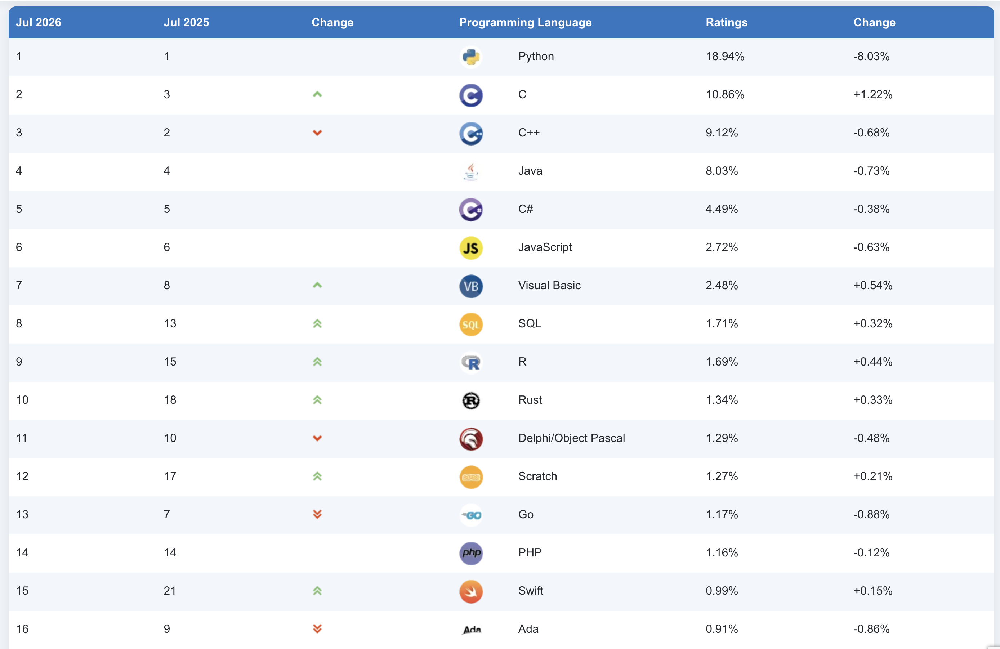

## 프로그래밍 언어 유형
- 정보 제공 기관에 따라 다름
	- TIOBE: 250개
	- 위키피디아: 700개
	- FOLDOC: 1000개
	- HOPL: 8,945개

- 최초의 프로그래밍 언어는 Plankalikul(플랭칼쿨)
	- 당시 구동되는 실물 컴퓨터는 존재하지 않아 종이로 제안

- https://www.tiobe.com/tiobe-index/
- 

## 좋은 코딩 기법
### 좋은 소프트웨어 코드의 6가지 공통점
#### 1. 쉽게 읽을 수 있다
- 다른 개발자도 최소한의 시간과 노력만을 투자하여 쉽게 이해할 수 있어야 한다.

- 이유
	- 한 번 개발된 코드는 수명 주기 동안 계속 누군가에게 읽혀지기 때문
		- 대표적인 예가 파이썬임
			- 파이썬에서 들여쓰기를 강제하여 코드의 가독성과 스타일의 일관성을 높임

#### 2. 주석이 잘 작성되어 있다
- 개발자가 코드를 개발한 목적(코드의 필요성)을 설명하는 주석이 작성되어야 한다.

#### 3. 코드 구조가 간결하다
- 간결하거나 단순한 코드가 좋은 코드이다

- 이유
	- 가독성을 향상 시킴
	- 코드의 복잡성이 낮아 버그를 줄일 수 있다.

- 롭 파이크 5가지 프로그램 원칙 중
	- **Rule 3.** Fancy algorithms are slow when n is small, and n is usually small. Fancy algorithms have big constants. Until you know that n is frequently going to be big, don't get fancy. (Even if n does get big, use Rule 2 first.)
		- 규칙 3. 복잡한 알고리즘은 n이 작을 때 느리고, n은 대개 작습니다. 복잡한 알고리즘은 상수값이 큽니다. n이 자주 커질 것이라는 것을 알기 전까지는 복잡한 알고리즘을 사용하지 마십시오. (n이 커지는 경우에도 규칙 2를 먼저 사용하십시오.)
	- **Rule 4.** Fancy algorithms are buggier than simple ones, and they're much harder to implement. Use simple algorithms as well as simple data structures.
		- 복잡한 알고리즘은 간단한 알고리즘보다 버그가 많고 구현하기도 훨씬 어렵습니다. 간단한 알고리즘과 간단한 자료 구조를 사용하세요.
#### 4. 변경에 탄력적이다
- 코드의 다른 부분은 망가뜨리지 않은면서 일부만 변경 또는 추가 할 수 있어야 한다
	- 파급 효과
		- 반대말 Shotgun Surgery => 응집도가 낮은 경우 발생
	- 코드의 결함도가 높은 경우 
#### 5. 활용을 위해 관리할 수 있어야 한다
- 관리성이 좋은 코드를 작성해야 한다
	- 누군가 버그를 수정해야하기 때문이다
	- 하드 코딩된 값은 지양해야 한다

``` java
@Slf4j  
@Service  
@RequiredArgsConstructor  
public class ContentService {  
  
    private static final String MARKDOWN_CONTENT_TYPE = "text/markdown";  
    private static final Duration UPLOAD_URL_EXPIRY = Duration.ofMinutes(5);  
  
    private final ContentRepository contentRepository;  
    private final S3ContentWriter s3ContentWriter;  
    private final S3UploadUrlIssuer uploadUrlIssuer;  
    private final NotionPageReader notionPageReader;  
    private final PostHogAnalytics analytics;  
    private final UploadLimitPolicy uploadLimitPolicy;  
    private final NotionImageRelocator notionImageRelocator;  
    private final NotionUploadRecorder notionUploadRecorder;
}
```

- 소프트웨어 코드 관리는 모듈화 관점에 개발 당사자가 관리 가능해야 한다
	- 관리할 수 없다면 모듈화가 잘못된 신호이다.

#### 제 기능을 해야 한다
- 코드가 정확히 본개 기능을 수행해야 한다.

### 좋은 코드 작성을 위한 12 가지 규칙
#### 1. 최적화보다는 가독성이 우선이다
- 이해하기 어려운 코드를 읽는 데 소비되는 시간과 비용 >= 최적화

>**Rule 3.** Fancy algorithms are slow when n is small, and n is usually small. Fancy algorithms have big constants. Until you know that n is frequently going to be big, don't get fancy. (Even if n does get big, use Rule 2 first.)
>
>규칙 3. 복잡한 알고리즘은 n이 작을 때 느리고, n은 대개 작습니다. 복잡한 알고리즘은 상수값이 큽니다. n이 자주 커질 것이라는 것을 알기 전까지는 복잡한 알고리즘을 사용하지 마십시오. (n이 커지는 경우에도 규칙 2를 먼저 사용하십시오.)

- 가독성이 높은 코드 == 모듈화가 잘된 코드
	- 모듈화가 잘된 코드는 종종 최적화에 위배되기도 한다
	- 하지만 가독성 있는 코드가 소프트웨어 전체 수명 주기를 고려할 때 비용을 더 절약할 수 있다.

#### 2. 아키텍처를 우선 개발하라
- 아키텍처의 설계가 없는 상황에서 코드를 작성하면 

- 코드를 작성하기 전 선행해야할 작업
	- 모듈화 방법
	- 서비스 동작 방법
	- 구조
	- 테스트 및 디버깅 방법
	- 업데이트 방법

#### 3. 테스트 커버리지를 고려하라
- 테스트가 필요한 상황
	- 한 달이상 변경되지 않는 코드
	- 오픈 소스 코드를 작성하는 경우
	- 핵심 코드 또는 금전적인 부분을 맞닿는 코드

- 테스트 코드가 필요 없는 경우
	- 홍보용 소프트웨어를 개발하는 경우
	- 팀이 작고 빠르게 변하는 경우

#### 4. 간단하고 단순하게 코딩하라
- KISS: Keep It Simple and Stupid

- 버그가 줄어들고 디버깅 시간도 줄어 든다.

- 불필요한 추상화 및 패턴 적용 없이 필요한 일만 수행 하도록 코드를 작성해야 한다.

#### 5. 주석을 작성하되 보조적으로 사용하라
- 주석을 달아주면 코드 가독성이 높아진다.
- 주석없이 코드를 이해할 수 있어야 좋은 코드이다.

#### 6. 강한 응집력과 느슨한 결합을 추구하라
- 코드내 결합뿐만 아니라 서버간의 

#### 7.코드 리뷰가 항상 좋은 것은 아니다
- 코드 리뷰의 목적은 코드에 내제된 오류를 찾는 것이다.
	- 시스템이 이해하는 목적이나 다른 팀원을 가르치려는 목적이 아니다
- 각 팀원이 책임지는 작은 부분을 완전히 이해하는 것이 더 낫다

#### 8. 리팩토링은 작동하지 않는다
- 리팩토링을 약속하고 급하게 개발하면 기술 부채가 커져 처음 부터 다시 작성해야 되는 상황이 종종 발생한다
- 처음부터 조금만 더 노력을 구조화된 코드를 작성하여 기술 부채가 커지지 않도록 개발하자

#### 9. 피곤하거나 컨디션이 좋지 않을 때는 코딩하지 마라
- 피곤할 때 평소보다 2~5배 더 많은 버그와 실수를 만들어 낸다.

#### 10. 모든 것을 한 번에 작성하지 마라. 반복적으로 개발하라
- 사용자가 정말로 필요로 하는 것이 무엇인지 분석하고 짧은 기간동안 개발할 수 있는 MVF를 선택한다
	- 작은 단위의 소프트웨어 모듈들을 반복적으로 개발하고 사용자에게 확인 받는 과정을 거처 개발의 생산성과 소프트웨어 품질을 높이는 방법이다
		- 애자일

> [!note]+ 반복적인 개발의 장점
> - 가설 -> 예측 -> 실험 사이클의 범위가 작을 수록 좋다.
> - 사이클이 작을수록 더 빠른 피드백을 받을 수 있다.
> - 작은 피드백일 수록 고치기 쉽다. 
> 	- ex) 단위 테스트 VS 빌드

#### 11. 가능하면 자동화 도구를 사용해라
- 소프트웨어는 자동화의 효과를 100% 거둘 수 있다.
- 휴먼 에러 감소를 통해 품질을 향상할 수 있다.

#### 12. 취미를 가져라
- 개발 업무에서 벗어나 다른 일을 하면서 정서적 안정감을 얻도록 하자
	- 새로운 아이디어
	- 집중력 향상
	- 생산성 향상

#### 14. 여유 시간에 새로운 것은 배워라
- IT 분야는 매우 빠르게 변화함
- 학습을 중단하면 퇴화하기 시작한다.
- 새로운 환경, 새로운 기술, 새로운 스타일을 적용하며 기술 변환에 대응 한다.

## 코딩 가이드 라인
### MISRA-C 코딩 표준 (Motor Industry Software Reliability Association for C language)
- 유럽의 자동차 연합에서 자동차 탑재 소프트웨어의 신뢰성및 호환성을 높이겠다는 의도로 개발한 C프로그램 코딩 표준

> - Directives: 안전이 중요한 소프트웨어를 만드는 사람이 가져야 할 태도

| 구분    | 주제                 | 담고 있는 내용                                                                                                                                                                                                                                                                                                                                                                                                          |                                                                                                               |
| ----- | ------------------ | ----------------------------------------------------------------------------------------------------------------------------------------------------------------------------------------------------------------------------------------------------------------------------------------------------------------------------------------------------------------------------------------------------------------- | ------------------------------------------------------------------------------------------------------------- |
| Dir 1 | 구현(Implementation) | 사용하는 컴파일러/처리계의 implementation-defined 동작을 파악하고 문서화<br><br>- **Dir 1.1** (구현 정의 동작 문서화)                                                                                                                                                                                                                                                                                                                            | - 컴파일러에 대한 위험<br><br>                                                                                         |
| Dir 2 | 컴파일과 빌드            | 모든 소스가 경고 없이 컴파일되도록 하고, 경고를 무시하지 않을 것<br><br>- **Dir 2.1** (에러 없이 컴파일)                                                                                                                                                                                                                                                                                                                                            | - 컴파일러에 의해 처리되는 것들에 대한 위험성                                                                                    |
| Dir 3 | 요구사항 추적성           | 모든 코드가 문서화된 요구사항으로 추적 가능할 것<br><br>- **Dir 3.1** (요구사항 추적성)                                                                                                                                                                                                                                                                                                                                                       | - 코드의 목적(존재 이유)                                                                                               |
| Dir 4 | 코드 설계              | 가장 많은 항목이 속하며, 설계·코딩 관행 전반<br><br>-**Dir 4.1** (런타임 실패 최소화), **Dir 4.12** (동적 메모리 금지), **Dir 4.15** (NaN/무한대 미검출 금지), **Dir 4.13** (리소스 함수 호출 순서)<br><br>- **Dir 4.14** (외부 입력 검증), **Dir 4.11** (라이브러리 인자 검증), **Dir 4.7** (오류 반환값 검사)<br><br>- **Dir 4.5** (혼동되는 식별자 금지), **Dir 4.6** (크기·부호 명시 타입), **Dir 4.9** (매크로보다 함수), **Dir 4.8** (구현 은닉), **Dir 4.2/4.3** (어셈블리 문서화·격리), **Dir 4.10** (헤더 중복 포함 방지)<br> | - 동작이 실행 시점에 알 수 없는 것은 구조를 설계 단계에서 제거한다<br><br>- 경계 밖에서 오는 것을 믿지 않는다<br><br>- 리뷰어가 오해할 여지를 남기는 코드는 그 자체로 결함이다 |
| Dir 5 | 동시성                | 데이터 경쟁·교착 상태 방지, 동적 스레드 생성 제한 (MISRA C:2023에서 추가)<br><br>**Dir 5.1** (데이터 경쟁 없음)<br>**Dir 5.2** (교착 없음)<br>**Dir 5.3** (동적 스레드 생성 금지)                                                                                                                                                                                                                                                                             | - 쓰레드에 동시성 문제<br><br>실행 중에 스레드가 생겼다 사라지면 시스템의 최악 실행 시간과 리소스 사용량을 정적으로 분석할 수 없습니다. 그래서 스레드 구성도 시작 시점에 확정하라     |

>- Rule
	- 프로그래밍에 사용되는 일반적인 구조체들에 대한 코드 작성의 준수 사항을 세부적으로 정의함
	- C 언어에서 겉보기와 실제 동작이 어긋나는 지점들의 목록, 그리고 그 지점을 피해 가는 방법

| 그룹           | 한 줄 메시지                                                |
| ------------ | ------------------------------------------------------ |
| 1. 표준 C 환경   | 언어가 보장하지 않는 영역(미정의·미명세 동작)에 발을 들이지 마라                  |
| 2. 미사용 코드    | 실행되지 않는 코드는 검증되지 않은 코드다                                |
| 3. 주석        | 주석이 코드를 삼키게 하지 마라 (`/* */` 중첩, 줄 끝 `\`)                |
| 4. 문자 집합     | 이식성을 해치는 문자 표현을 쓰지 마라                                  |
| 5. 식별자       | 이름이 겹쳐 보이면 사람은 반드시 착각한다                                |
| 6. 타입        | 비트필드처럼 구현에 따라 달라지는 표현을 신뢰하지 마라                         |
| 7. 리터럴       | `010`이 8이 되는 함정처럼, 상수의 겉모습과 값이 달라선 안 된다                |
| 8. 선언과 정의    | 컴파일러가 추측하게 하지 말고 전부 명시하라                               |
| 9. 초기화       | 값을 쓰기 전에 반드시 값을 넣어라                                    |
| 10. 본질 타입 모델 | 암묵적 타입 변환은 소리 없이 값을 망가뜨린다                              |
| 11. 포인터 변환   | 포인터의 타입은 메모리 해석 규칙이니 함부로 바꾸지 마라                        |
| 12. 표현식      | 연산자 우선순위를 기억력에 맡기지 말고 괄호로 못박아라                         |
| 13. 부작용      | 한 표현식 안에서 평가 순서에 의존하지 마라                               |
| 14. 제어 표현식   | 조건문의 참·거짓은 의도가 눈에 보여야 한다                               |
| 15. 제어 흐름    | 흐름은 위에서 아래로 한 방향이어야 추적 가능하다 (`goto`, 다중 `return` 제한)   |
| 16. switch 문 | 모든 경우를 빠짐없이 다루고, fall-through를 우연에 맡기지 마라              |
| 17. 함수       | 함수는 정해진 인자로 들어가 정해진 값으로 나와야 한다 (가변 인자·재귀 금지)           |
| 18. 포인터와 배열  | 포인터 연산은 자기 배열의 경계를 넘지 마라                               |
| 19. 중첩 저장소   | 같은 메모리를 두 가지 타입으로 보지 마라 (`union`, 겹치는 대입)              |
| 20. 전처리기     | 매크로는 컴파일러가 보기 전의 텍스트 치환일 뿐임을 잊지 마라                     |
| 21. 표준 라이브러리 | 표준 라이브러리라고 다 안전한 것은 아니다 (`atoi`, `system`, `setjmp` 등) |
| 22. 리소스      | 열었으면 닫고, 얻었으면 반납하라                                     |

### 시큐어 코딩
- 목적: 구현 단계에서 해킹 공격을 유발할 수 있는 가능성을 제거한다

## 오픈 소스 기반 개발
- 오픈 소스 기반 개발의 장점
	- 처음부터 모든 것을 다 구축하지 않아도 된다
		- 편리성
		- 신속성
		- 비용 절감
### 오픈 소스 기반 개발 프로세스

### 오픈 소스 활용 시 주의 사항
#### 라이선스 권한의 확인 검토
- 오픈 소스를 활용하는 경우 오픈소스의 라이선스에 따라 오픈소스를 활용한 코드를 공개를 요구함
#### 오픈 소스 검증 체계 구축
- 오픈 소스의 취약점과 라이선스를 확인해야 한다.
	- 자동화된 도구 사용
#### 지속적인 오픈 소스 관리
- 오픈소스의 라이센스가 변경되거나 취약점이 추가될 수 있기 때문에 지속적인 감시와 관리가 필요하다
#### 철저한 기술 검토
- 오픈 소스 도입전 오픈 소스에 대한 철저한 검증이 필요하다
	- 버그
	- 연동시 문제 상황

> [!note]+ 카카오 오픈소스 관리 (Olive Platform)
> - **실시간 자동 스캔:** GitHub 프로젝트와 연동하여 코드 내 사용된 오픈소스 의존성과 컴포넌트를 실시간으로 분석합니다.
> - **라이선스 및 리포트 제공:** 사용된 오픈소스의 라이선스 종류(Permissive 및 Copyleft 등)를 식별하고 잠재적 이슈와 체크리스트를 리포트로 제공합니다.
> - **고지문 관리:** 서비스 배포 시 필요한 오픈소스 고지문을 체계적으로 관리하고 미리보기 기능을 지원합니다.
> - **공급망 보안 강화:** 오픈소스 컴포넌트의 취약점을 파악하고 체계적인 컴플라이언스 체계를 구축하여 공급망 공격에 대응합니다

#### 오픈 소스 변경 사항 기록
- 오픈 소스의 변경 사항을 추적 가능해야 한다.
### 오픈 소스 활용 환경

#### 오픈 소스 검색 및 분석 도구
- Solr
- ElasticSearch
- Lucene
- Sphinx
#### 오픈 소스 개발 지원 도구
##### Git
- 오픈소스 기반 분산 제어 시스템
##### Eclipse IDE
- java 중심의 통합 개발 환경
##### Apache NetBeans
- 데스크톱, 모바일 및 앱 응용 프로그램을 만들 수 있는 오픈 소스 기반 통합 개발 환경
##### Ruby on Rails
- 오픈 소스 웹 애플리케이션 개발 프레임워크
- MVC 아키텍처 지원
- 웹 개발 전반을 지원
##### Bootstrap
- 반응형 모바일 프로젝트를 구축하는데 사용되는 프론트엔드 구성 요소를 제공하는 라이브러리
### 오픈 소스 기반 개발의 베스트 프랙틱스
- 팀 의사소통 증대
- 사용자 피드백
- 동료 검토
- 신속한 배포
- 투명성
- 좋은 코드 설계
---

